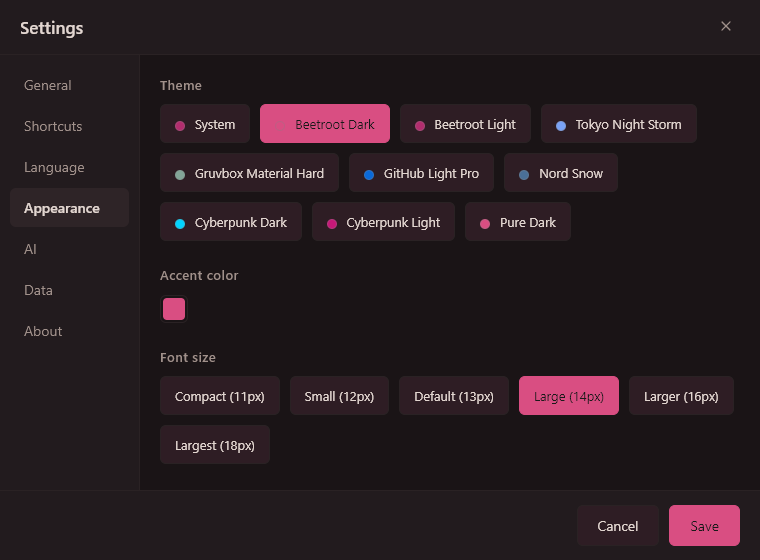
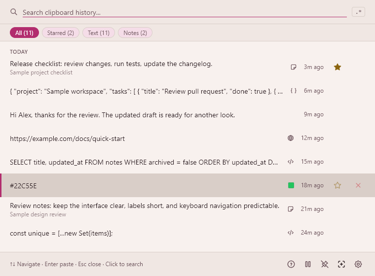

<p align="center">
  
</p>

<h1 align="center">Beetroot</h1>

<p align="center">
  <a href="https://github.com/mnardit/beetroot-releases">Código fuente</a> · <a href="CONTRIBUTING.md">Contribuir</a> · <a href="https://max.nardit.com">Max Nardit</a>
</p>

<p align="center">
  El gestor de portapapeles que Windows debería haber incluido.<br/>
  Transformaciones con IA, OCR y búsqueda difusa en todo el historial — a un atajo de distancia.
</p>

<p align="center">
  <a href="https://github.com/mnardit/beetroot-releases/releases/latest"></a>
  <a href="https://github.com/mnardit/beetroot-releases/releases"></a>
  
  
  <a href="LICENSE"></a>
</p>

<p align="center">
  <a href="https://github.com/mnardit/beetroot-releases/releases/latest"><strong>Descargar Beetroot (gratis)</strong></a> · <a href="https://apps.microsoft.com/detail/9ng50mkds58x">Microsoft Store</a> · <a href="https://max.nardit.com/beetroot">Sitio web</a> · <a href="https://github.com/mnardit/beetroot-releases/releases">Changelog</a>
</p>

<p align="center">
  <a href="README.md">English</a> · <a href="README.de.md">Deutsch</a> · <b>Español</b> · <a href="README.ru.md">Русский</a> · <a href="README.zh.md">中文</a> · <a href="README.ja.md">日本語</a>
</p>

> **Beetroot ahora es de código abierto bajo [Apache 2.0](LICENSE).** Explore el código, informe de errores o participe en el desarrollo. Creado por [Max Nardit](https://max.nardit.com).
>
> **Estado del lanzamiento:** La versión instalable actual es [1.6.6](https://github.com/mnardit/beetroot-releases/releases/tag/v1.6.6). Este README describe el código del repositorio; los cambios de [Unreleased](CHANGELOG.md#unreleased), incluido el nuevo almacenamiento de claves, están previstos para 1.6.7 y todavía no están en esa descarga.

---

## ¿Por qué no Win+V?

| Función                   | Win+V                             | Beetroot                                                                                     |
| ------------------------- | --------------------------------- | -------------------------------------------------------------------------------------------- |
| Historial                 | 25 clips, se pierden al reiniciar | Ilimitado, persistente entre reinicios                                                       |
| Búsqueda                  | No                                | Difusa + regex                                                                               |
| Transformaciones IA       | No                                | 4 proveedores cloud + modelos locales, 10 de texto + 5 de visión integradas + personalizadas |
| AI Vision                 | No                                | Leer texto, describir, extraer datos de imágenes con IA                                      |
| Seguimiento de app origen | No                                | Icono, nombre y título de ventana por clip                                                   |
| OCR                       | No                                | Motor nativo de Windows, local                                                               |
| Historial de imágenes     | Solo miniaturas                   | Imágenes completas, almacenadas localmente                                                   |
| Temas                     | No                                | 9 temas + modo Auto + color de acento                                                        |
| Pegar como texto plano    | No                                | Atajo dedicado                                                                               |
| Multi-monitor             | No                                | La ventana sigue al cursor                                                                   |
| Fijar arriba              | No                                | Fijar + arrastrar a cualquier lugar                                                          |
| Notas                     | No                                | Anotaciones con búsqueda                                                                     |

---

## Capturas de pantalla

<p align="center">
  
</p>

| Acciones de IA                                                                    | Apariencia                                                                        |
| --------------------------------------------------------------------------------- | --------------------------------------------------------------------------------- |
|  |  |

<details>
<summary>Más capturas de pantalla</summary>

| Tema oscuro                               | Tema claro                                |
| ----------------------------------------- | ----------------------------------------- |
|  |  |

| Menú contextual e IA                                     | Vista previa de JSON                               |
| -------------------------------------------------------- | -------------------------------------------------- |
|  |  |

</details>

---

## Instalación

**[Descargue el último .exe desde GitHub Releases](https://github.com/mnardit/beetroot-releases/releases/latest)** o instálelo desde **[Microsoft Store](https://apps.microsoft.com/detail/9ng50mkds58x)**.

O use un gestor de paquetes:

```powershell
# Winget
winget install MNardit.Beetroot

# Scoop
scoop bucket add beetroot https://github.com/mnardit/scoop-bucket
scoop install beetroot

# Chocolatey
choco install beetroot
```

**Requisitos:** Windows 10 o posterior.

---

## Características

### Búsqueda y flujo de trabajo

- **Búsqueda de 5 fases** — subcadena exacta → inicio de palabra → metadatos → difusa. Tolerancia a errores con resultados clasificados
- **Modo regex** — `/pattern/` con resaltado de coincidencias
- **Filtros** — texto, imágenes, favoritos, notas — un clic para filtrar
- **Pegado rápido**: `Ctrl+1..9` selecciona un clip reciente con la lista de Beetroot activa; no es un atajo global cuando la ventana está oculta.
- **Operaciones por lotes** — selección múltiple con `Ctrl+Click`, luego copiar (separador personalizable) o eliminar
- **Detección de contenido** — badges automáticos para URLs, emails, código, JSON, colores. Detección de lenguajes de programación con ML (54 idiomas) para vista previa de código
- **Instancia única** — abrir Beetroot de nuevo enfoca la ventana existente

### Transformaciones IA

- **4 proveedores en la nube + local** — OpenAI, Gemini, Claude, DeepSeek o local (LM Studio, Ollama), cambio con un clic
- **Procesamiento en segundo plano** — haga clic en un prompt, el menú se cierra al instante, notificación cuando termine. Encole varias transformaciones
- **Modelos de razonamiento** — Qwen3, DeepSeek R1 y similares funcionan directamente (elimina automáticamente las etiquetas `<think>`)
- **10 prompts de texto** — corregir gramática, traducir, resumir, reescribir, extraer datos, formatear como código y más
- **Prompts personalizados** — cree hasta 20 propios, accesibles desde el menú contextual
- **BYOK** — use su propia clave de OpenAI, o prescinda de ella con un modelo local
- **Rust nativo** — todas las llamadas a APIs de IA se ejecutan en código nativo, no en el motor del navegador. Sin problemas de CORS, funciona con la ventana oculta

### AI Vision

- **5 prompts de visión integrados** — Leer Texto, Describir Imagen, Extraer Datos, Resumir Imagen, Traducir Texto de Imagen
- **Funciona con cualquier imagen del historial** — capturas de pantalla, fotos, escaneos, notas manuscritas
- **Cloud + local** — GPT-5.4, Claude, Gemini o modelos locales (Ollama llava/bakllava/moondream, LM Studio)
- **Prompts de visión personalizados** — cree los suyos en Configuración → IA → tipo "Imagen"
- **Casos de uso:** leer recetas manuscritas, extraer datos de recibos, OCR de capturas en otros idiomas, describir gráficos y diagramas

<details>
<summary>Modelos locales recomendados para transformaciones de texto</summary>

| Modelo                           | Tamaño  | Velocidad           | Ideal para                                  |
| -------------------------------- | ------- | ------------------- | ------------------------------------------- |
| **Qwen3 8B** (Q4_K)              | ~5 GB   | Rápido              | Gramática, traducción, reescritura          |
| **Gemma 3 4B** (Q4_K)            | ~3 GB   | Muy rápido          | Corrección de errores, reescrituras simples |
| **Phi-4 Mini 3.8B** (Q4_K)       | ~2.5 GB | Muy rápido          | Código y texto estructurado                 |
| **Llama 3.1 8B** (Q4_K)          | ~5 GB   | Rápido              | Uso general                                 |
| **Mistral Small 3.1 24B** (Q4_K) | ~14 GB  | Lento (16+ GB VRAM) | Calidad premium                             |
| **DeepSeek R1 7B** (Q4_K)        | ~5 GB   | Rápido              | Reescrituras complejas, resúmenes           |

Probado con [LM Studio](https://lmstudio.ai), [Ollama](https://ollama.com) y [llama.cpp](https://github.com/ggml-org/llama.cpp). Configure en Configuración → IA → LLM Local.

</details>

### Seguimiento de app origen

- **Vea de dónde proviene cada clip** — icono de la app, nombre y título de ventana
- **Filtre por app** — desplegable "Apps" con búsqueda, ordenar por último uso / más usado / alfabético
- **Incluido en búsquedas** — la app origen y el título de ventana se incluyen en la búsqueda difusa y regex

### OCR

- **Extraer texto de imágenes** — clic derecho en cualquier imagen → OCR
- **Motor nativo de Windows** — sin nube, sin subidas, totalmente offline
- **Instantáneo** — asíncrono, nunca bloquea la interfaz

### Personalización

- **9 temas** — Beetroot Dark/Light, Tokyo Night Storm, Gruvbox, GitHub Light, Nord Snow, Cyberpunk Dark/Light, Pure Dark (OLED #000000), más modo Auto
- **Efectos de ventana** — Mica, Acrylic o Solid; detectados automáticamente según la versión de Windows
- **Tipografía** — 8 fuentes de interfaz, 5 fuentes de código, 6 tamaños predefinidos
- **26 idiomas** — EN, RU, DE, ES, ZH, JA, FR, PT, KO, TR, IT, PL, NL, UK, TH, HI, ID, VI, CS, HU, RO, SV, DA, FI, NB, MS
- **Fijar ventana** — siempre visible, arrastrar entre monitores, o modo seguir cursor
- **Todos los atajos personalizables** — reasigne todo en Configuración → Atajos; compatible con AZERTY, QWERTZ y AltGr

### Fiabilidad

- **Copias de la base de datos**: hasta 3 copias rotativas y una instantánea antes de migrar la base. Las imágenes y la configuración requieren una copia aparte.
- **Recuperación con aviso**: cuando es posible, restaura una base dañada desde una copia válida conservando el original; pueden faltar entradas recientes.
- **Avisos de sincronización en la nube** — alerta si la carpeta de datos está en OneDrive, Dropbox o Google Drive
- **Comprobación de unidad**: avisa sobre unidades extraíbles y carpetas sincronizadas; rechaza unidades de red para la base de datos.
- **Auto-actualización** — actualizador integrado, o desactivar para operación completamente offline

---

## Atajos de teclado

| Atajo        | Acción                     |
| ------------ | -------------------------- |
| `` Ctrl+` `` | Mostrar / ocultar Beetroot |
| `Enter`      | Pegar clip seleccionado    |
| `Ctrl+1..9`  | Pegado rápido              |
| `Space`      | Vista previa               |
| `Alt+T`      | Transformar con IA         |
| `Alt+P`      | Fijar ventana arriba       |
| `Alt+F`      | Modo seguir cursor         |
| `Shift+F10`  | Menú contextual            |
| `Ctrl+C`     | Copiar al portapapeles     |
| `Alt+Del`    | Eliminar                   |

Todos los atajos son personalizables en **Configuración → Atajos**. Compatible con layouts AZERTY, QWERTZ y AltGr.

---

## FAQ

**¿Beetroot es gratis?**
Sí. Gratis para uso personal y comercial — sin anuncios, sin pruebas, sin limitaciones, sin telemetría.

**¿Beetroot envía los datos del portapapeles a algún lugar?**
El historial se almacena localmente. La IA en la nube recibe solo el contenido seleccionado y el prompt cuando solicita una transformación. La IA local usa un servidor de loopback; sus registros y conexiones dependen de su configuración. Las actualizaciones y las pruebas de claves también realizan solicitudes. Consulte [PRIVACY.md](PRIVACY.md).

**¿Puede Beetroot leer texto en imágenes?**
Sí. Haga clic derecho en cualquier imagen del historial → IA → Leer Texto. Funciona con proveedores en la nube (GPT-5.4, Claude, Gemini) y modelos de visión locales (Ollama llava, LM Studio). Para OCR simple sin IA, use la función de OCR integrada (motor nativo de Windows, completamente offline).

**¿AI Vision funciona sin conexión?**
Sí, con un modelo descargado en un servidor local. Beetroot se conecta mediante loopback; revise la configuración del servidor para trabajar sin internet.

**¿Dónde se almacena mi clave API?**
En el Administrador de credenciales de Windows (Windows Credential Manager), separado de la configuración de la app. La clave se envía al proveedor de IA seleccionado cuando solicita una operación de IA o valida la clave guardada. Consulte [PRIVACY.md](PRIVACY.md) para los detalles de migración de claves antiguas.

**¿Dónde se almacenan mis datos?**
Por defecto en `%APPDATA%\com.beetroot.desktop\`; consulte la carpeta seleccionada en Configuración > Datos. Cierre Beetroot desde la bandeja antes de copiar toda la carpeta. La configuración y las claves API se guardan por separado. Siga las [instrucciones de copia](PRIVACY.md#exporting-clipboard-history).

**¿Funciona la auto-actualización?**
Sí, desde v1.0.6. Los usuarios de v1.0.5 o anterior necesitan [descargar manualmente](https://github.com/mnardit/beetroot-releases/releases/latest) una vez — después la auto-actualización funciona normalmente. Puede desactivarla en Configuración → General.

---

## Solución de problemas

**La auto-actualización no funciona (v1.0.5 o anterior)**
Un cambio único en la clave de firma requiere [descargar la última versión manualmente](https://github.com/mnardit/beetroot-releases/releases/latest). Las actualizaciones futuras funcionarán automáticamente.

**OCR no funciona o baja calidad**
OCR usa el motor nativo de Windows. Asegúrese de que el paquete de idioma correspondiente está instalado: Configuración → Hora e idioma → Idioma → Agregar un idioma → marque "Voz" o "Escritura básica".

**Beetroot no abre o el atajo no funciona**

- Verifique si otra app está usando el mismo atajo (ej. `Ctrl+``)
- Compruebe que Beetroot y la aplicación de destino están en la misma sesión de Windows; un proceso normal no puede enviar entradas a una aplicación con privilegios elevados.
- Reasigne el atajo en Configuración → Atajos

**Aviso de SmartScreen o antivirus**
Windows puede mostrar SmartScreen para instaladores sin una reputación establecida del editor. Use la [página oficial de versiones](https://github.com/mnardit/beetroot-releases/releases/latest) y compruebe el origen del archivo antes de ejecutarlo. Las firmas del actualizador Tauri son distintas de Windows Authenticode.

---

## Comentarios y reportes de errores

¿Encontró un error o tiene una sugerencia? [Abra un issue](https://github.com/mnardit/beetroot-releases/issues).

Por favor incluya:

- Versión de Beetroot (Configuración → Acerca de)
- Versión de Windows (`winver`)
- Pasos para reproducir
- Captura de pantalla o mensaje de error si aplica

---

## Desarrollo y contribuciones

[CONTRIBUTING.md](CONTRIBUTING.md) explica la preparación, las pruebas y el primer PR. El desarrollo nativo requiere Windows; las comprobaciones del frontend también funcionan en Linux y macOS. No se necesitan claves de firma para compilar localmente. Consulte la [arquitectura](docs/architecture.md) para orientarse en el código.

Son bienvenidos los informes de errores, las traducciones y las correcciones concretas. Consulte primero las funciones grandes. Para vulnerabilidades, use el canal privado de [SECURITY.md](SECURITY.md), no un issue público.

---

## Licencia

Disponible bajo la [Apache License 2.0](LICENSE). Se permiten el uso personal y comercial, la modificación y la redistribución según sus términos. Atribución de autoría: [NOTICE](NOTICE). Los componentes de terceros conservan sus [respectivas licencias](THIRD_PARTY_NOTICES.md).

[Privacy Policy](PRIVACY.md) · [Security Policy](SECURITY.md) · [Terms of Service](TERMS.md)

<details>
<summary>Fuentes de terceros y créditos</summary>

**Fuentes** (SIL Open Font License 1.1):

- [Inter](https://github.com/rsms/inter) — Copyright 2020 The Inter Project Authors
- [Open Sans](https://github.com/googlefonts/opensans) — Copyright 2020 The Open Sans Project Authors
- [Montserrat](https://github.com/JulietaUla/montserrat) — Copyright 2011 The Montserrat Project Authors
- [Noto Sans](https://github.com/notofonts/latin-greek-cyrillic) — Copyright 2022 The Noto Project Authors
- [JetBrains Mono](https://github.com/JetBrains/JetBrainsMono) — Copyright 2020 The JetBrains Mono Project Authors

**Creado con:** [Tauri v2](https://tauri.app/) · React 19 · Rust · SQLite · TypeScript

</details>

---

<p align="center">
  <a href="https://github.com/mnardit/beetroot-releases/releases/latest"><strong>Descargar Beetroot</strong></a> · ¿Te gusta? Una ⭐ ayuda a que otros lo descubran.
</p>

<p align="center">
  Creado por <a href="https://max.nardit.com">Max Nardit</a>
</p>
