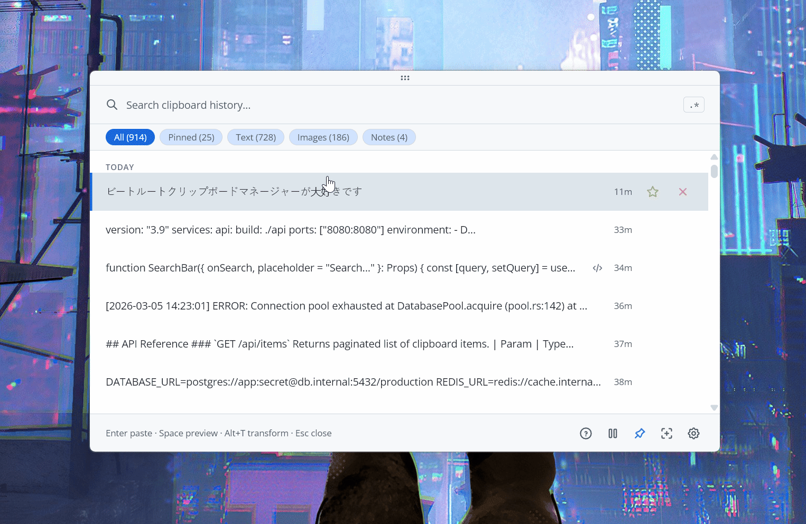
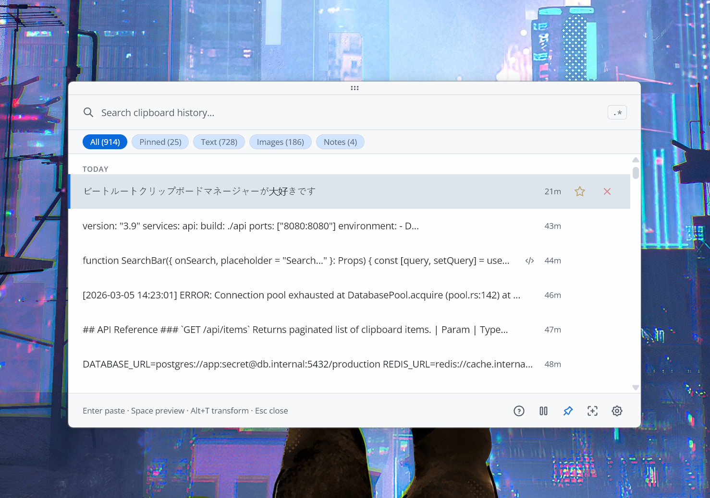
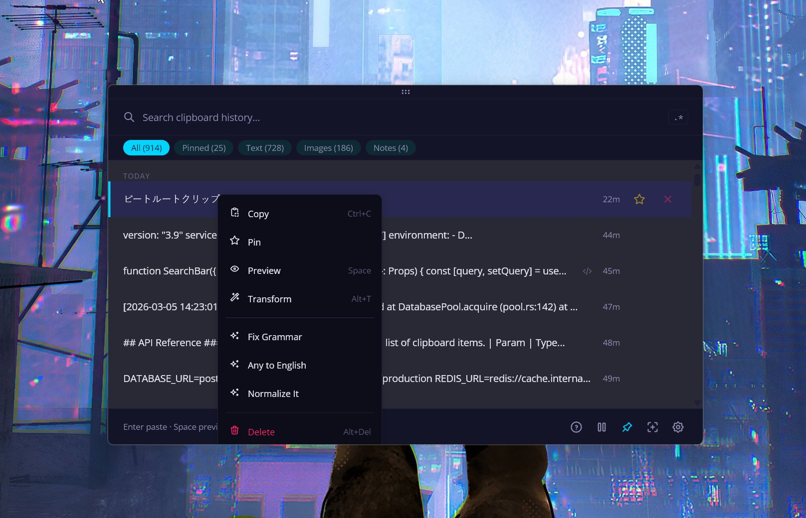
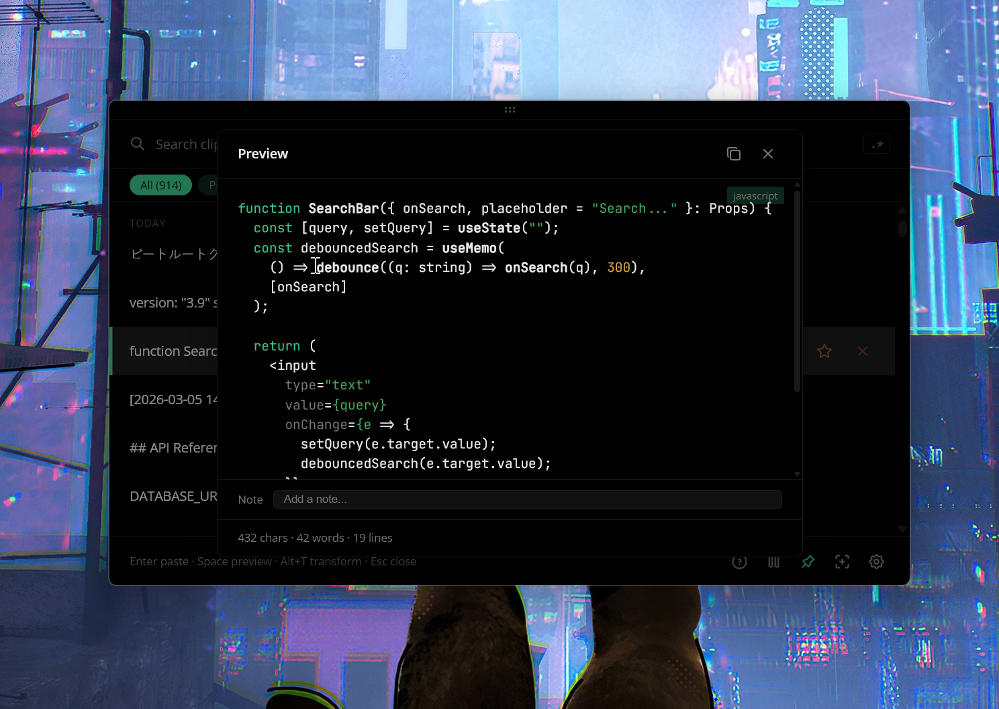
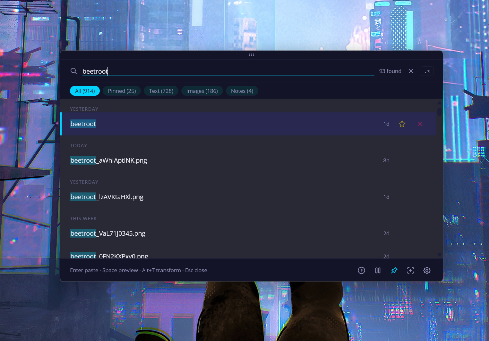
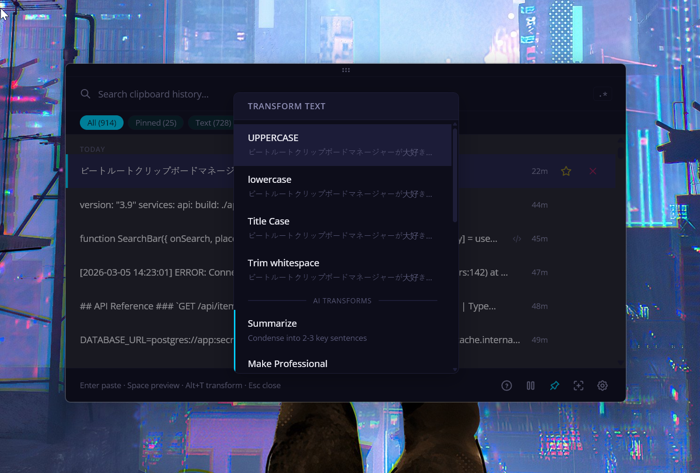
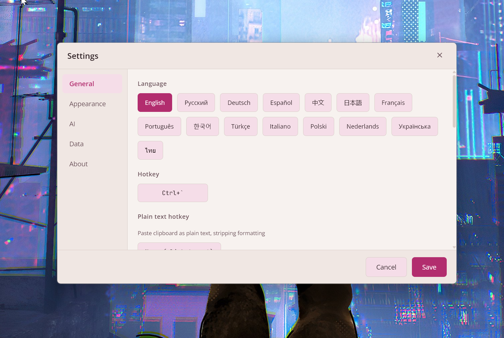
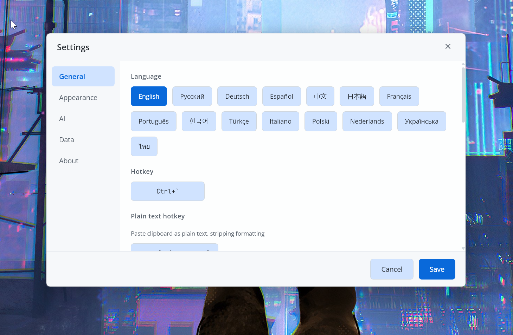

<p align="center">
  
</p>

<h1 align="center">Beetroot</h1>

<p align="center">
  Windowsに標準搭載されるべきだったクリップボードマネージャー。<br/>
  AI変換、OCR、履歴全体のあいまい検索 — すべてひとつのショートカットキーで。
</p>

<p align="center">
  <a href="https://github.com/mnardit/beetroot-releases/releases/latest"></a>
  <a href="https://github.com/mnardit/beetroot-releases/releases"></a>
  
  
  
</p>

<p align="center">
  <a href="https://github.com/mnardit/beetroot-releases/releases/latest"><strong>ダウンロード</strong></a> · <a href="https://max.nardit.com/beetroot">ウェブサイト</a> · <a href="https://github.com/mnardit/beetroot-releases/releases">変更履歴</a>
</p>

<p align="center">
  <a href="README.md">English</a> · <a href="README.de.md">Deutsch</a> · <a href="README.es.md">Español</a> · <a href="README.ru.md">Русский</a> · <a href="README.zh.md">中文</a> · <b>日本語</b>
</p>

> このリポジトリにはリリースとドキュメントが含まれています。ソースコードはプロプライエタリです。

---

## 実際の動作

<p align="center">
  
</p>

| AI変換 | テーマ |
|---|---|
|  |  |

| ダークテーマ | ライトテーマ |
|---|---|
|  |  |

<details>
<summary>その他のスクリーンショット</summary>

| コンテキストメニューとAI | コードプレビュー |
|---|---|
|  |  |

| 検索 | AI変換メニュー |
|---|---|
|  |  |

| 設定 | 言語 |
|---|---|
|  |  |

</details>

---

## インストール

**[GitHub Releasesから最新の.exeをダウンロード](https://github.com/mnardit/beetroot-releases/releases/latest)**

またはパッケージマネージャーを使用：

```powershell
# Winget
winget install MNardit.Beetroot

# Scoop
scoop bucket add beetroot https://github.com/mnardit/scoop-bucket
scoop install beetroot

# Chocolatey
choco install beetroot
```

> [!NOTE]
> **v1.0.5以前からアップグレードする場合：** 署名キーの一度限りの変更により、自動更新は動作しません。[最新バージョンを手動でダウンロード](https://github.com/mnardit/beetroot-releases/releases/latest)してください — 以降のアップデートは自動で行われます。

**動作要件：** Windows 10以降。

---

## なぜWin+Vではないのか？

| 機能 | Win+V | Beetroot |
|---|---|---|
| 履歴 | 25クリップ、再起動で消失 | 無制限、永続保存 |
| 検索 | なし | あいまい検索 + 正規表現 |
| AI変換 | なし | 10個の組み込み + カスタムプロンプト |
| OCR | なし | Windows標準エンジン、ローカル処理 |
| 画像履歴 | サムネイルのみ | フル画像、ローカル保存 |
| テーマ | なし | 9テーマ + 自動モード + アクセントカラー |
| プレーンテキスト貼り付け | なし | 専用ショートカット |
| マルチモニター | なし | ウィンドウがカーソルに追従 |
| ピン留め | なし | ピン留め + 自由にドラッグ |
| メモ | なし | 検索可能な注釈 |

---

## クイックスタート

1. **インストール** — .exeをダウンロードまたはwinget/scoop/chocoを使用
2. **起動** — `` Ctrl+` ``（カスタマイズ可能）を押してBeetrootを表示
3. **検索** — 入力するだけであいまい検索、または `/正規表現/`
4. **お気に入りとメモ** — 右クリック → お気に入りで上部に固定、メモでコンテキストを追加
5. **AIとOCR** — 右クリック → 変換でAI、または画像を右クリック → OCR

---

## 機能

### 検索とワークフロー

- **あいまい検索** — タイプミスがあっても何でも見つかる
- **正規表現モード** — `/pattern/` でパワーユーザー向けのマッチハイライト
- **フィルター** — テキスト、画像、お気に入り、メモ — ワンクリックで絞り込み
- **クイック貼り付け** — `Ctrl+1..9` でウィンドウを開かずに最近のクリップを貼り付け
- **一括操作** — `Ctrl+Click`で複数選択、一括コピーまたは削除
- **コンテンツ検出** — URL、メール、コード、JSON、色を自動バッジ表示；クリックでURL開く
- **シングルインスタンス** — Beetrootを再起動すると既存のウィンドウにフォーカス

### AI変換

- **10個の組み込みプロンプト** — 文法修正、翻訳、要約、書き換え、データ抽出、コードフォーマットなど
- **カスタムプロンプト** — 最大20個、右クリックメニューからアクセス
- **BYOK** — 自分のOpenAI APIキーを使用；Beetrootはデータを保存・中継しません
- **GPT-5 nano/mini** — 高速で低コスト、短いテキスト向けに最適化

### OCR

- **画像からテキスト抽出** — 画像を右クリック → OCR
- **Windows標準エンジン** — クラウドなし、アップロードなし、完全オフライン
- **即座に実行** — 非同期処理、アプリをブロックしない

### カスタマイズ

- **9テーマ** — Beetroot Dark/Light、Tokyo Night Storm、Gruvbox、GitHub Light、Nord Snow、Cyberpunk Dark/Light、Pure Dark（OLED #000000）、自動モード付き
- **ウィンドウエフェクト** — Mica、Acrylic、またはSolid；Windowsバージョンに応じて自動検出
- **タイポグラフィ** — UIフォント8種、コードフォント5種、サイズ6段階
- **26言語** — EN、RU、DE、ES、ZH、JA、FR、PT、KO、TR、IT、PL、NL、UK、TH、HI、ID、VI、CS、HU、RO、SV、DA、FI、NB、MS
- **ウィンドウピン留め** — 常に最前面、モニター間でドラッグ、またはカーソル追従モード
- **すべてのショートカットをカスタマイズ** — 設定 → ショートカットですべて変更可能；AZERTY、QWERTZ、AltGr対応

### 信頼性

- **自動バックアップ** — 3コピーローテーション + 更新前にスナップショット
- **自動復旧** — 破損を検出し、バックアップから静かに復元
- **クラウド同期警告** — データフォルダがOneDrive、Dropbox、Google Drive内にある場合に警告
- **ドライブ検出** — USBやネットワークドライブへの書き込み前に警告
- **自動更新** — 組み込みアップデーター、完全オフライン運用では無効化可能

---

## ショートカットキー

| ショートカット | アクション |
|---|---|
| `` Ctrl+` `` | Beetrootの表示/非表示 |
| `Enter` | 選択クリップを貼り付け |
| `Ctrl+1..9` | クイック貼り付け |
| `Space` | プレビュー |
| `Alt+T` | AI変換 |
| `Alt+P` | ウィンドウピン留め |
| `Alt+F` | カーソル追従モード |
| `Shift+F10` | コンテキストメニュー |
| `Ctrl+C` | クリップボードにコピー |
| `Alt+Del` | 削除 |

すべてのショートカットは**設定 → ショートカット**でカスタマイズ可能。AZERTY、QWERTZ、AltGrレイアウトに対応。Win+Spaceで切り替えるとラベルが即座に更新されます。

---

## FAQ

**Beetrootは無料ですか？**
はい。個人利用・商用利用ともに無料 — 広告なし、試用期限なし、機能制限なし、テレメトリなし。

**Beetrootはクリップボードデータをどこかに送信しますか？**
いいえ。すべてのデータはマシン上のローカルSQLiteデータベースに保存されます。AI変換は、明示的に変換を選択した場合にのみ、選択したテキストをOpenAI APIに送信します — しかもご自身のAPIキーを使用してのみ。

**OpenAIに正確には何が送信されますか？**
右クリック → 変換したテキストのみ。リクエストはマシンからOpenAI APIに直接送信されます。Beetrootはデータを閲覧、保存、中継しません。APIキーなし = ネットワークリクエストゼロ。

**APIキーはどこに保存されますか？**
アプリのローカル設定（WebView2プロファイルのlocalStorage）に保存されます。マシンから外に出ることはありません。

**データはどこに保存されますか？**
デフォルトでは `%LOCALAPPDATA%\com.beetroot.desktop\`。設定 → データで移動可能。データベースは標準的なSQLiteファイル — フォルダをコピーするだけでバックアップできます。

**Beetrootは Windows 10で動作しますか？**
はい。Windows 10と11の両方に対応。MicaとAcrylicウィンドウエフェクトはWindows 11で利用可能。

**複数のBeetrootウィンドウを開けますか？**
いいえ。Beetrootはシングルインスタンスです — 再起動すると既存のウィンドウにフォーカスします。

**自動更新は動作しますか？**
はい、v1.0.6以降。v1.0.5以前のユーザーは一度[手動でダウンロード](https://github.com/mnardit/beetroot-releases/releases/latest)する必要があります — その後は自動更新が正常に動作します。設定 → 一般で自動更新を無効にできます。

---

## プライバシーとセキュリティ

データはマシン上に保持されます。テレメトリ、アナリティクス、クラウド同期、アカウントなし。

- [Privacy Policy](PRIVACY.md)
- [Security Policy](SECURITY.md)
- [Terms of Service](TERMS.md)

---

## トラブルシューティング

**自動更新が動作しない（v1.0.5以前）**
署名キーの一度限りの変更により、[最新バージョンを手動でダウンロード](https://github.com/mnardit/beetroot-releases/releases/latest)する必要があります。以降の更新は自動で行われます。

**OCRが動作しない、または品質が低い**
OCRはWindows標準エンジンを使用しています。対応する言語パックがインストールされていることを確認してください：設定 → 時刻と言語 → 言語 → 言語の追加 → 「音声認識」または「基本入力」にチェック。

**Beetrootが開かない、またはホットキーが動作しない**
- 他のアプリが同じホットキーを使用していないか確認（例：`Ctrl+``）
- 一度管理者として実行を試す
- 設定 → ショートカットでホットキーを変更

**SmartScreenやウイルス対策の警告**
Beetrootはまだコード署名されていません（証明書申請中）。SmartScreenで「詳細情報」→「実行」をクリックしてください。これは誤検知です — アプリは安全です。

---

## フィードバックとバグ報告

バグを発見、または機能リクエストがありますか？[Issueを作成](https://github.com/mnardit/beetroot-releases/issues)してください。

以下を含めてください：
- Beetrootバージョン（設定 → バージョン情報）
- Windowsバージョン（`winver`）
- 再現手順
- スクリーンショットまたはエラーメッセージ（該当する場合）

---

## ライセンス

個人利用・商用利用ともに無料。ソースコードはプロプライエタリです。

<details>
<summary>サードパーティフォントとクレジット</summary>

**フォント**（SIL Open Font License 1.1）：
- [Inter](https://github.com/rsms/inter) — Copyright 2020 The Inter Project Authors
- [Open Sans](https://github.com/googlefonts/opensans) — Copyright 2020 The Open Sans Project Authors
- [Montserrat](https://github.com/JulietaUla/montserrat) — Copyright 2011 The Montserrat Project Authors
- [Noto Sans](https://github.com/notofonts/latin-greek-cyrillic) — Copyright 2022 The Noto Project Authors
- [JetBrains Mono](https://github.com/JetBrains/JetBrainsMono) — Copyright 2020 The JetBrains Mono Project Authors

**使用技術：** [Tauri v2](https://tauri.app/) · React 19 · Rust · SQLite · TypeScript

</details>

---

<p align="center">
  Beetroot を気に入りましたか？ ⭐ を付けると、他の人も見つけやすくなります。
</p>

<p align="center">
  <a href="https://max.nardit.com">Max Nardit</a> 制作
</p>
