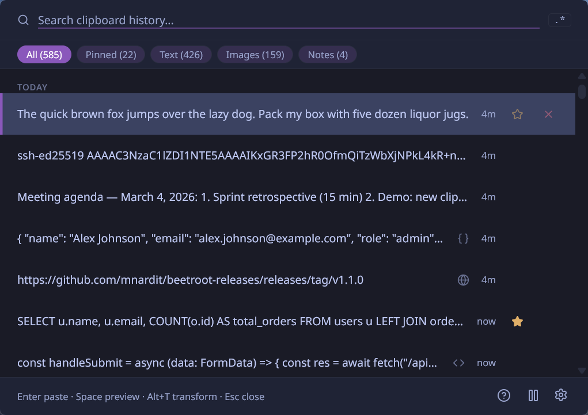
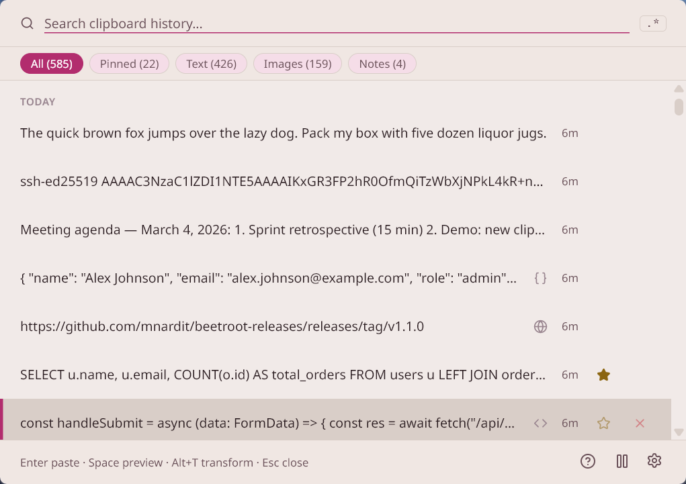
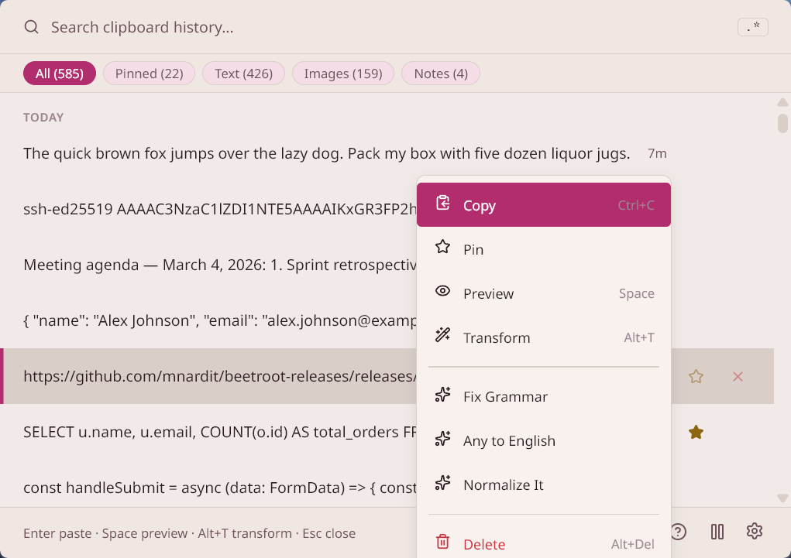
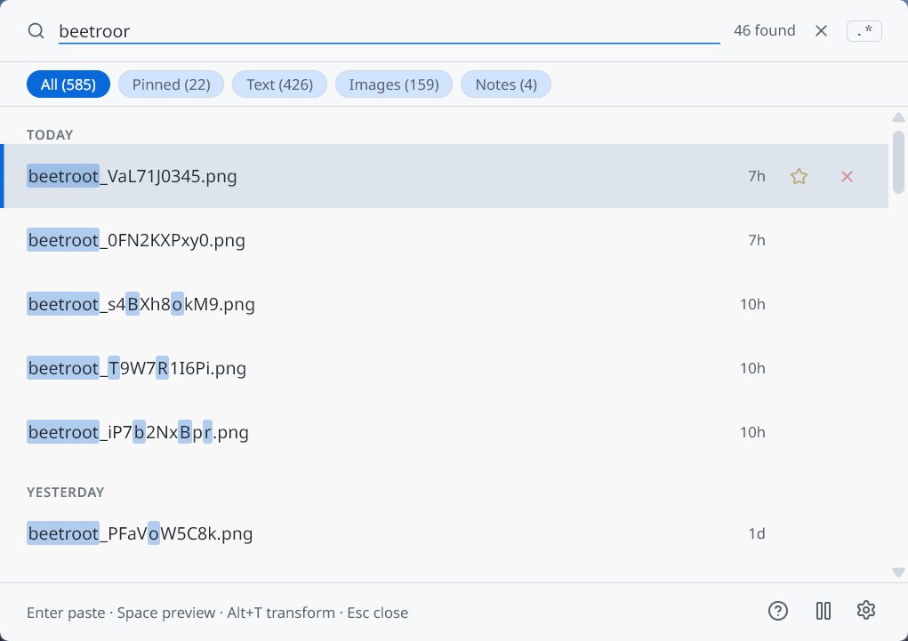
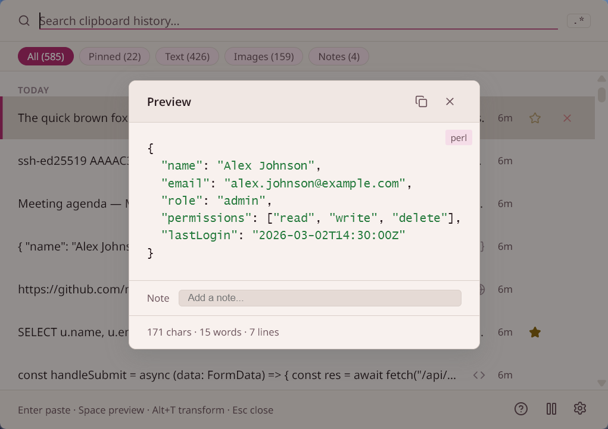
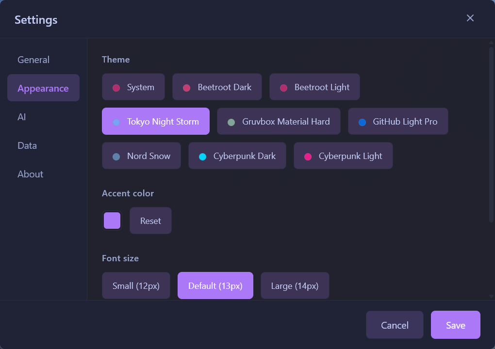

# Beetroot

[](https://github.com/mnardit/beetroot-releases/releases/latest)
[](https://github.com/mnardit/beetroot-releases/releases)
[](https://github.com/mnardit/beetroot-releases/releases/latest)
[](https://max.nardit.com/beetroot)

**A smart clipboard manager for Windows with built-in AI transforms.**

**Website:** [max.nardit.com/beetroot](https://max.nardit.com/beetroot)



## Download

Get the latest version from [Releases](https://github.com/mnardit/beetroot-releases/releases).

**Windows Installer (recommended):** Download `Beetroot_x64-setup.exe`

> **Upgrading from v1.0.5 or earlier?** Auto-update won't work for this release due to a signing key change. Please [download v1.0.6 manually](https://github.com/mnardit/beetroot-releases/releases/latest). Future updates will work automatically.

## Features

- **AI-powered text transforms** — Fix grammar, translate, summarize, rewrite, simplify, shorten, explain, extract data, format as code, bullet points. 10 built-in prompts + custom prompts with quick-access in the right-click menu. Requires your own OpenAI API key (BYOK).
- **Unlimited clipboard history** — Text and images, persisted in SQLite across reboots. Pin important items so they never get lost.
- **Fuzzy search and regex filtering** — Find anything instantly. Filter by type: text, images, pinned, notes.
- **OCR text extraction** — Right-click any image to extract text using the native Windows OCR engine. No external services, no network calls.
- **Notes on clipboard items** — Annotate any entry with a note for later context. Searchable.
- **Content detection** — Automatic badges for URLs, emails, code, JSON, and colors. Open detected URLs directly in your browser.
- **8 themes + custom accent color** — Beetroot Dark/Light, Tokyo Night Storm, Gruvbox Material Hard, GitHub Light Pro, Nord Snow, Cyberpunk Dark/Light, plus Auto mode. Override the accent color with any hex value.
- **Window effects** — Glass, Frosted, or Solid transparency with Mica on Windows 11.
- **Global hotkeys** — Default `Ctrl+`` to show/hide. Fully configurable. Supports non-QWERTY layouts (AZERTY, QWERTZ) and AltGr combinations. Separate optional hotkey for plain text paste.
- **Multi-monitor aware** — Window always appears on the monitor where your cursor is.
- **Keyboard-first design** — `Ctrl+1..9` quick paste, `Alt+T` transform, `Space` preview, `Alt+P` pin, `Alt+Del` delete, arrow keys to navigate.
- **Rich text or plain text paste** — Choose whether to preserve formatting or strip it.
- **Batch operations** — Multi-select with `Ctrl+Click`, then batch delete or batch copy with configurable separator.
- **Syntax highlighting** — Code preview with automatic language detection.
- **Auto-update** — Built-in updater checks for new versions and installs with one click. Can be disabled in Settings for fully offline operation.
- **Auto-delete** — Optionally clear history after 1, 7, or 30 days.
- **i18n** — English, Russian, German, Spanish, Chinese, Japanese, French, Portuguese, Korean, Turkish.

## Screenshots

| Dark theme | Light theme |
|---|---|
|  |  |

| Context menu with AI | Fuzzy search |
|---|---|
|  |  |

| Preview with syntax highlighting | Appearance settings |
|---|---|
|  |  |

## Why not Win+V?

| Feature | Win+V | Beetroot |
|---|---|---|
| AI transforms | No | 10 built-in + custom prompts |
| Search | No | Fuzzy search + regex |
| Image history | Thumbnails only | Full images stored locally |
| OCR | No | Native Windows OCR |
| History limit | 25 items | Unlimited |
| Persists across reboots | No | Yes |
| Themes | No | 8 themes + custom accent color |
| Plain text paste | No | Configurable (rich or plain) |
| Multi-monitor | No | Follows cursor |
| Notes on items | No | Yes |
| Auto-delete | No | 1 / 7 / 30 days |
| Keyboard shortcuts | Basic | 10+ shortcuts, Ctrl+1..9 quick paste |

## Install

Download the latest `.exe` installer from [Releases](https://github.com/mnardit/beetroot-releases/releases).

Or install via package manager:

```powershell
# Winget
winget install MNardit.Beetroot

# Chocolatey
choco install beetroot

# Scoop
scoop bucket add beetroot https://github.com/mnardit/scoop-bucket
scoop install beetroot
```

**Requirements:** Windows 10 or later.

## Tech stack

Tauri v2 (Rust backend) + React 19 + TypeScript + SQLite + Vite

## Built by

[Max Nardit](https://github.com/mnardit) — analyst turned builder. After 10 years on macOS, switched to Windows and built the clipboard manager it was missing.

## License

Beetroot is free for personal and commercial use. Source code is proprietary.
