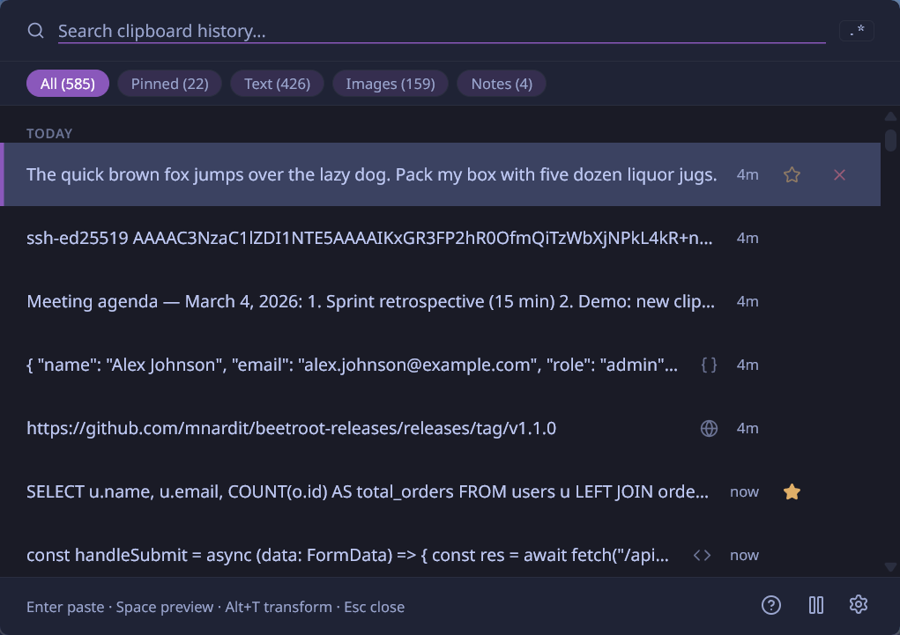
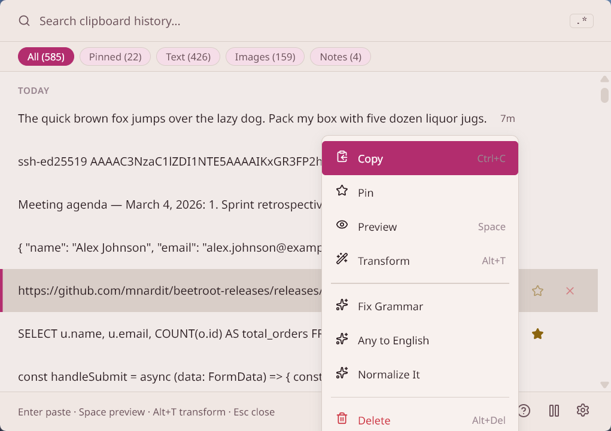
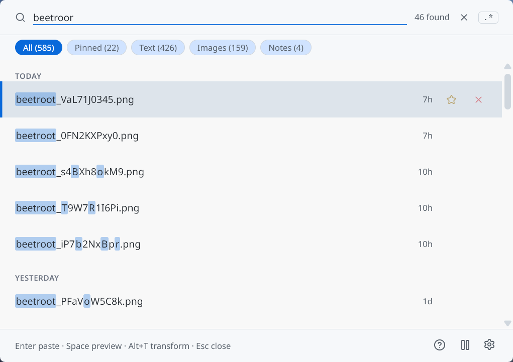
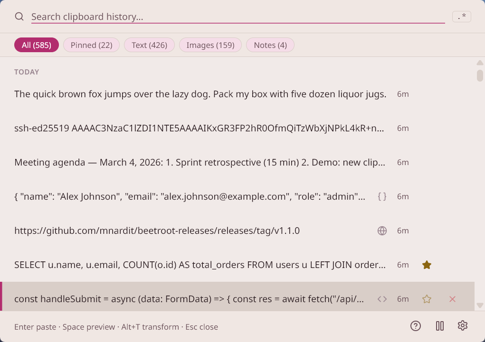
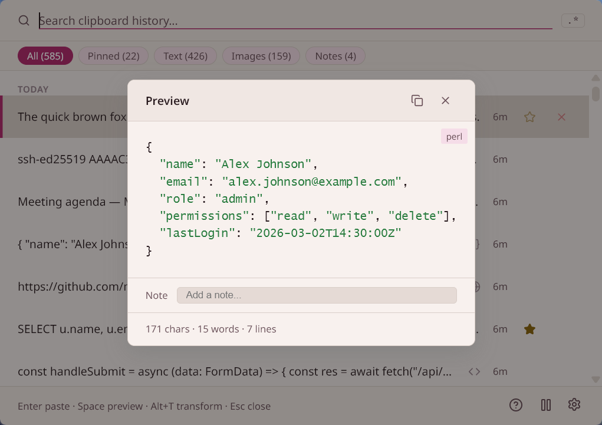
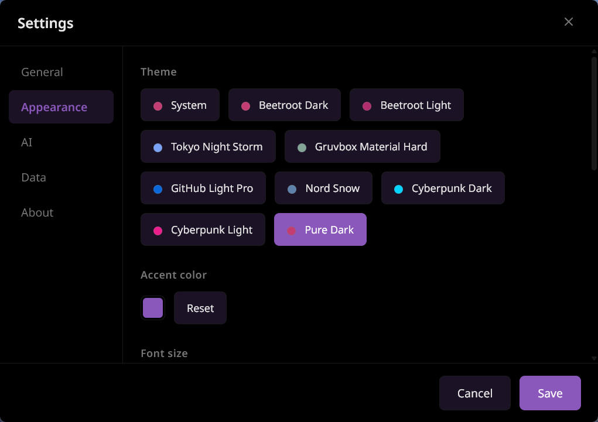
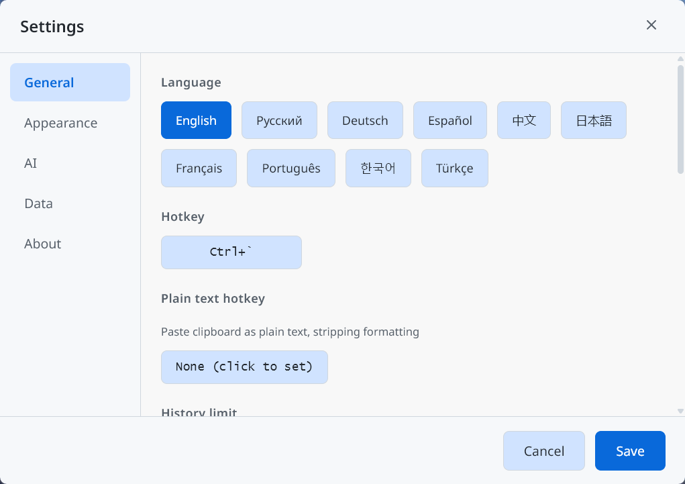

# Beetroot

[](https://github.com/mnardit/beetroot-releases/releases/latest)
[](https://github.com/mnardit/beetroot-releases/releases)
[](https://max.nardit.com/beetroot)

**The clipboard manager Windows should have built.** AI transforms, OCR, search across your entire clipboard history.

Your data stays on your machine. No telemetry. No cloud. No account required.

**Website:** [max.nardit.com/beetroot](https://max.nardit.com/beetroot)



## Why I built this

I used Paste on macOS for years. When I switched to Windows, the built-in Win+V felt like a toy — 25-item limit, no search, gone after reboot. Ditto works but looks like it's from 2005. So I built the clipboard manager I wanted to use every day.

— [Max Nardit](https://max.nardit.com)

## Download

Get the latest version from [**Releases**](https://github.com/mnardit/beetroot-releases/releases/latest).

Or install via package manager:

```powershell
# Winget
winget install MNardit.Beetroot

# Scoop
scoop bucket add beetroot https://github.com/mnardit/scoop-bucket
scoop install beetroot

# Chocolatey
choco install beetroot
```

> [!NOTE]
> **Upgrading from v1.0.5 or earlier?** Auto-update won't work due to a signing key change. Please [download manually](https://github.com/mnardit/beetroot-releases/releases/latest). Users on v1.0.6+ get updates automatically.

**Requirements:** Windows 10 or later.

## What makes Beetroot different

### AI Transforms

Select any clipboard item and let AI rewrite it — fix grammar, translate to English, summarize, make professional, simplify, shorten, explain, extract key data, format as code, or create bullet points. 10 built-in prompts plus your own custom ones, all accessible from the right-click menu.

Bring your own OpenAI API key. No subscription to Beetroot.



### OCR

Copied a screenshot? Right-click it and extract the text. Runs entirely on-device using the native Windows OCR engine. No uploads, no external services, instant.

### Search

Find that thing you copied three weeks ago. Fuzzy search handles typos, regex mode for power users. Filter by type — text, images, pinned items, or notes.



## Beetroot vs Win+V

| | Win+V | Beetroot |
|---|---|---|
| AI transforms | — | 10 built-in + custom prompts |
| Search | — | Fuzzy + regex |
| OCR | — | Native, on-device |
| Image history | Thumbnails, limited | Full images, stored locally |
| History size | 25 items, lost on reboot | Unlimited, persists forever |
| Themes | — | 9 themes + custom accent |
| Plain text paste | — | Dedicated hotkey |
| Multi-monitor | — | Window follows your cursor |

## All features

- **Unlimited history** — every text and image you copy, persisted across reboots
- **Pin and notes** — pin important items, annotate with searchable notes
- **9 themes** — Beetroot Dark/Light, Tokyo Night Storm, Gruvbox, GitHub Light, Nord Snow, Cyberpunk Dark/Light, Pure Dark (OLED black), plus Auto mode
- **Window effects** — Glass, Frosted, or Solid transparency. Mica on Windows 11.
- **Typography** — customizable UI font (6 presets) and code font (5 presets) with adjustable size
- **Global hotkeys** — default `Ctrl+`` `, fully configurable. Works with any keyboard layout (AZERTY, QWERTZ, AltGr). Separate hotkey for plain text paste. Instant layout detection when switching with Win+Space.
- **Keyboard-first** — `Ctrl+1..9` quick paste, `Alt+T` AI transform, `Space` preview, `Alt+P` pin, `Ctrl+C` copy, `Alt+Del` delete
- **Content detection** — auto-badges for URLs, emails, code, JSON, colors. Click to open URLs.
- **Batch operations** — multi-select with `Ctrl+Click`, then batch delete or copy with separator
- **Syntax highlighting** — automatic language detection in preview
- **Auto-update** — one-click updates, or disable in Settings for fully offline operation
- **10 languages** — English, Russian, German, Spanish, Chinese, Japanese, French, Portuguese, Korean, Turkish

## Screenshots

| Dark theme | Light theme |
|---|---|
|  |  |

| Context menu & AI | JSON preview |
|---|---|
|  |  |

| Themes | Languages & hotkeys |
|---|---|
|  |  |

## License

Beetroot is free for personal and commercial use. Source code is proprietary.

### Third-party fonts

Beetroot bundles the following fonts under the [SIL Open Font License 1.1](https://openfontlicense.org/):

- [Inter](https://github.com/rsms/inter) — Copyright 2020 The Inter Project Authors
- [Noto Sans](https://github.com/notofonts/latin-greek-cyrillic) — Copyright 2022 The Noto Project Authors
- [JetBrains Mono](https://github.com/JetBrains/JetBrainsMono) — Copyright 2020 The JetBrains Mono Project Authors

Built with Tauri, React, and Rust.
