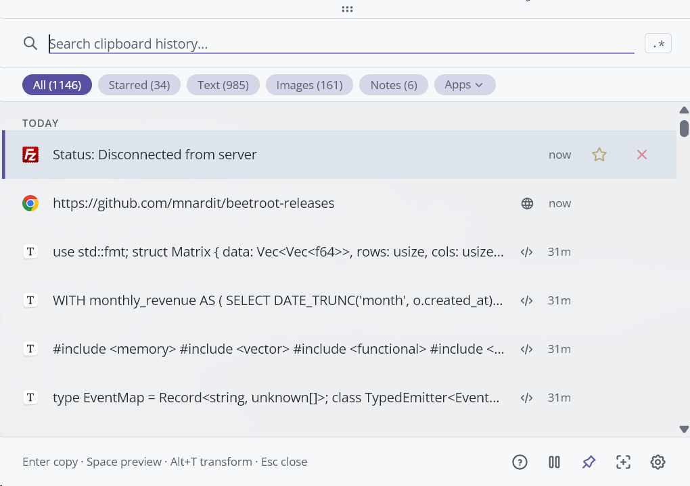

<p align="center">
  
</p>

<h1 align="center">Beetroot</h1>

<p align="center">
  Windows 本该内置的剪贴板管理器。<br/>
  AI 转换、OCR、模糊搜索全部历史记录 — 只需一个快捷键。
</p>

<p align="center">
  <a href="https://github.com/mnardit/beetroot-releases/releases/latest"></a>
  <a href="https://github.com/mnardit/beetroot-releases/releases"></a>
  
  
</p>

<p align="center">
  <a href="https://github.com/mnardit/beetroot-releases/releases/latest"><strong>下载 Beetroot（免费）</strong></a> · <a href="https://max.nardit.com/beetroot">官网</a> · <a href="https://github.com/mnardit/beetroot-releases/releases">更新日志</a>
</p>

<p align="center">
  <a href="README.md">English</a> · <a href="README.de.md">Deutsch</a> · <a href="README.es.md">Español</a> · <a href="README.ru.md">Русский</a> · <b>中文</b> · <a href="README.ja.md">日本語</a>
</p>

> **v1.6.2 新功能：** 重写键盘处理，无焦点模式输入更可靠。全新预览面板支持方向键导航。多项稳定性和性能改进。[查看更新内容 →](https://github.com/mnardit/beetroot-releases/releases/tag/v1.6.2)

---

## 为什么不用 Win+V？

| 功能 | Win+V | Beetroot |
|---|---|---|
| 历史记录 | 25 条 clip，重启后丢失 | 无限制，跨重启永久保存 |
| 搜索 | 无 | 模糊搜索 + 正则表达式 |
| AI 转换 | 无 | 4 个云端提供商 + 本地模型，10 个内置 + 自定义 |
| 来源应用追踪 | 无 | 每条 clip 显示图标、应用名、窗口标题 |
| OCR | 无 | Windows 原生引擎，本地处理 |
| 图片历史 | 仅缩略图 | 完整图片，本地存储 |
| 主题 | 无 | 9 个主题 + 自动模式 + 强调色 |
| 纯文本粘贴 | 无 | 专用快捷键 |
| 多显示器 | 无 | 窗口跟随光标 |
| 置顶 | 无 | 置顶 + 任意拖动 |
| 备注 | 无 | 可搜索的注释 |

---

## 实际效果

<p align="center">
  
</p>

| AI 转换 | 主题 |
|---|---|
|  |  |

<details>
<summary>更多截图</summary>

| 深色主题 | 浅色主题 |
|---|---|
|  |  |

| 右键菜单与 AI | 代码预览 |
|---|---|
|  |  |

| 搜索 | AI 转换菜单 |
|---|---|
|  |  |

| 设置 | 语言 |
|---|---|
|  |  |

</details>

---

## 安装

**[从 GitHub Releases 下载最新 .exe](https://github.com/mnardit/beetroot-releases/releases/latest)**

或使用包管理器：

```powershell
# Winget
winget install MNardit.Beetroot

# Scoop
scoop bucket add beetroot https://github.com/mnardit/scoop-bucket
scoop install beetroot

# Chocolatey
choco install beetroot
```

**系统要求：** Windows 10 或更高版本。

---

## 功能

### 搜索与工作流

- **5 阶段搜索** — 精确子串 → 词首匹配 → 元数据 → 模糊。容错搜索，结果按相关性排序
- **正则模式** — `/pattern/` 支持匹配高亮
- **过滤器** — 文本、图片、收藏、备注 — 一键筛选
- **快速粘贴** — `Ctrl+1..9` 无需打开窗口即可粘贴最近的 clip
- **批量操作** — `Ctrl+Click` 多选，然后复制（自定义分隔符）或删除
- **内容检测** — 自动识别 URL、邮箱、代码、JSON、颜色。ML 驱动的编程语言检测（54 种语言），用于代码预览
- **单实例** — 再次启动 Beetroot 将聚焦现有窗口

### AI 转换

- **4 个云端提供商 + 本地** — OpenAI、Gemini、Claude、DeepSeek 或本地（LM Studio、Ollama），一键切换
- **推理模型** — Qwen3、DeepSeek R1 等开箱即用（自动去除 `<think>` 标签）
- **10 个内置提示词** — 修正语法、翻译、摘要、改写、提取数据、格式化代码等
- **自定义提示词** — 最多 20 个，可从右键菜单访问
- **BYOK** — 使用您自己的 OpenAI 密钥，或使用本地模型无需密钥

<details>
<summary>推荐的本地文本转换模型</summary>

| 模型 | 大小 | 速度 | 适用场景 |
|-------|------|-------|----------|
| **Qwen3 8B** (Q4_K) | ~5 GB | 快 | 语法修正、翻译、改写 |
| **Gemma 3 4B** (Q4_K) | ~3 GB | 很快 | 修正错别字、简单改写 |
| **Phi-4 Mini 3.8B** (Q4_K) | ~2.5 GB | 很快 | 代码和结构化文本 |
| **Llama 3.1 8B** (Q4_K) | ~5 GB | 快 | 通用场景 |
| **Mistral Small 3.1 24B** (Q4_K) | ~14 GB | 慢（需 16+ GB 显存） | 高质量输出 |
| **DeepSeek R1 7B** (Q4_K) | ~5 GB | 快 | 复杂改写、摘要 |

已通过 [LM Studio](https://lmstudio.ai)、[Ollama](https://ollama.com) 和 [llama.cpp](https://github.com/ggml-org/llama.cpp) 测试。在设置 → AI → Local LLM 中配置。

</details>

### 来源应用追踪

- **查看每条 clip 的来源** — 应用图标、名称和窗口标题
- **按应用过滤** — "应用"下拉菜单支持搜索，可按最近使用 / 最常使用 / 字母排序
- **可搜索** — 来源应用和窗口标题包含在模糊搜索和正则搜索中

### OCR

- **从图片提取文字** — 右键点击图片 → OCR
- **Windows 原生引擎** — 无云端、无上传，完全离线
- **即时** — 异步运行，不阻塞界面

### 自定义

- **9 个主题** — Beetroot Dark/Light、Tokyo Night Storm、Gruvbox、GitHub Light、Nord Snow、Cyberpunk Dark/Light、Pure Dark（OLED #000000），以及自动模式
- **窗口效果** — Mica、Acrylic 或 Solid；根据 Windows 版本自动检测
- **字体** — 8 种 UI 字体、5 种代码字体、6 种大小预设
- **26 种语言** — EN、RU、DE、ES、ZH、JA、FR、PT、KO、TR、IT、PL、NL、UK、TH、HI、ID、VI、CS、HU、RO、SV、DA、FI、NB、MS
- **窗口置顶** — 始终显示在最前，可在显示器间拖动，或使用光标跟随模式
- **所有快捷键可自定义** — 在设置 → 快捷键中重新映射；支持 AZERTY、QWERTZ、AltGr

### 可靠性

- **自动备份** — 3 份轮换 + 每次更新前快照
- **自动恢复** — 检测损坏，静默从备份恢复
- **云同步警告** — 当数据文件夹位于 OneDrive、Dropbox 或 Google Drive 时发出警告
- **驱动器检测** — 写入 USB 或网络驱动器前发出警告
- **自动更新** — 内置更新器，也可禁用以完全离线运行

---

## 快捷键

| 快捷键 | 操作 |
|---|---|
| `` Ctrl+` `` | 显示 / 隐藏 Beetroot |
| `Enter` | 粘贴选中项 |
| `Ctrl+1..9` | 快速粘贴 |
| `Space` | 预览 |
| `Alt+T` | AI 转换 |
| `Alt+P` | 窗口置顶 |
| `Alt+F` | 光标跟随模式 |
| `Shift+F10` | 右键菜单 |
| `Ctrl+C` | 复制到剪贴板 |
| `Alt+Del` | 删除 |

所有快捷键可在**设置 → 快捷键**中自定义。支持 AZERTY、QWERTZ 和 AltGr 键盘布局。

---

## 常见问题

**Beetroot 是免费的吗？**
是的。个人和商业使用均免费 — 无广告、无试用、无功能限制、无遥测。

**Beetroot 会发送我的剪贴板数据吗？**
不会。所有数据存储在本地 SQLite 数据库中。使用本地 AI 模型时，任何数据都不会离开您的电脑。如果使用云 AI 服务（OpenAI、Gemini、Anthropic 或 DeepSeek），仅在您明确选择转换时将选中文本发送到其 API — 且使用您自己的密钥。

**我的 API 密钥存储在哪里？**
在应用的本地设置中（WebView2 配置文件中的 localStorage）。它绝不会离开您的电脑。

**我的数据存储在哪里？**
默认在 `%APPDATA%\com.beetroot.desktop\`。可在设置 → 数据中移动。数据库是标准 SQLite 文件 — 复制文件夹即可备份。

**自动更新可用吗？**
是的，v1.0.6 起可用。v1.0.5 及更早版本的用户需要[手动下载](https://github.com/mnardit/beetroot-releases/releases/latest)一次 — 之后自动更新正常工作。可在设置 → 通用中禁用自动更新。

---

## 故障排除

**自动更新不工作（v1.0.5 及更早版本）**
由于一次性签名密钥更换，需要[手动下载最新版本](https://github.com/mnardit/beetroot-releases/releases/latest)。之后的更新将自动进行。

**OCR 不工作或质量差**
OCR 使用 Windows 原生引擎。请确保安装了对应语言包：设置 → 时间和语言 → 语言 → 添加语言 → 勾选"语音"或"基本输入"。

**Beetroot 无法打开或快捷键无响应**
- 检查是否有其他应用占用了相同快捷键（如 `Ctrl+``）
- 尝试以管理员身份运行一次以排除权限问题
- 在设置 → 快捷键中重新映射

**SmartScreen 或杀毒软件警告**
Beetroot 尚未进行代码签名（证书申请中）。在 SmartScreen 中点击"更多信息"→"仍要运行"。可在[发布页面](https://github.com/mnardit/beetroot-releases/releases/latest)验证 .exe 的校验和。

---

## 反馈与错误报告

发现 bug 或有功能建议？[创建 issue](https://github.com/mnardit/beetroot-releases/issues)。

请包含：
- Beetroot 版本（设置 → 关于）
- Windows 版本（`winver`）
- 复现步骤
- 截图或错误信息（如有）

---

## 许可证

个人和商业使用均免费。源代码为专有软件。

[Privacy Policy](PRIVACY.md) · [Security Policy](SECURITY.md) · [Terms of Service](TERMS.md)

<details>
<summary>第三方字体与致谢</summary>

**字体**（SIL Open Font License 1.1）：
- [Inter](https://github.com/rsms/inter) — Copyright 2020 The Inter Project Authors
- [Open Sans](https://github.com/googlefonts/opensans) — Copyright 2020 The Open Sans Project Authors
- [Montserrat](https://github.com/JulietaUla/montserrat) — Copyright 2011 The Montserrat Project Authors
- [Noto Sans](https://github.com/notofonts/latin-greek-cyrillic) — Copyright 2022 The Noto Project Authors
- [JetBrains Mono](https://github.com/JetBrains/JetBrainsMono) — Copyright 2020 The JetBrains Mono Project Authors

**构建技术：** [Tauri v2](https://tauri.app/) · React 19 · Rust · SQLite · TypeScript

</details>

---

<p align="center">
  <a href="https://github.com/mnardit/beetroot-releases/releases/latest"><strong>下载 Beetroot</strong></a> · 喜欢的话，点个 ⭐ 帮助更多人发现它。
</p>

<p align="center">
  由 <a href="https://max.nardit.com">Max Nardit</a> 开发
</p>
