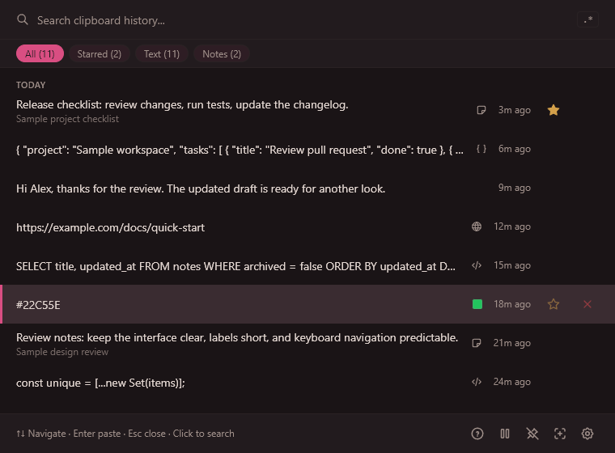
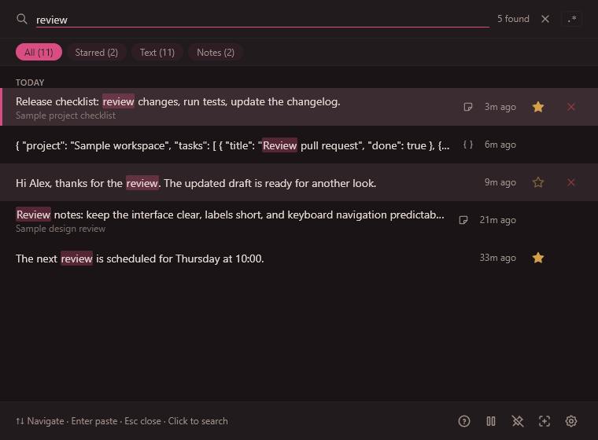
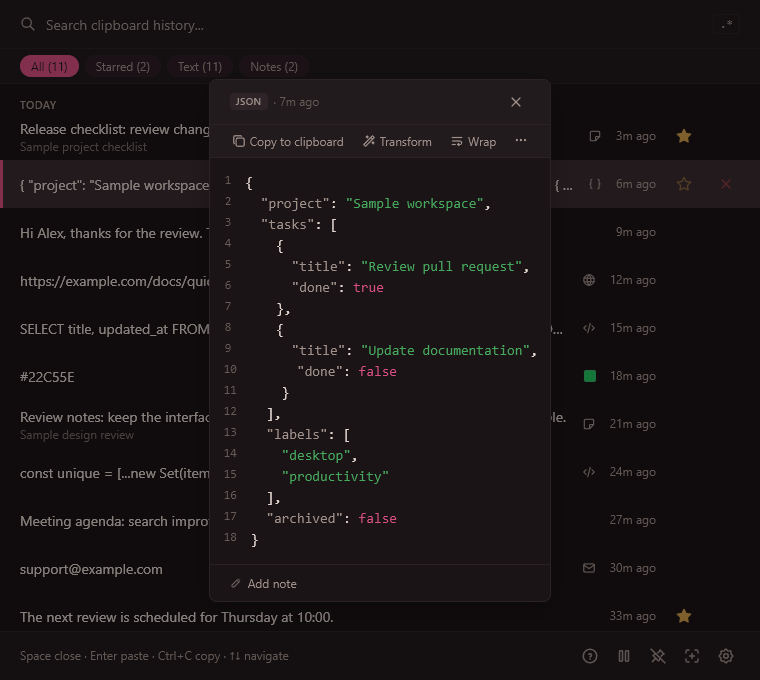
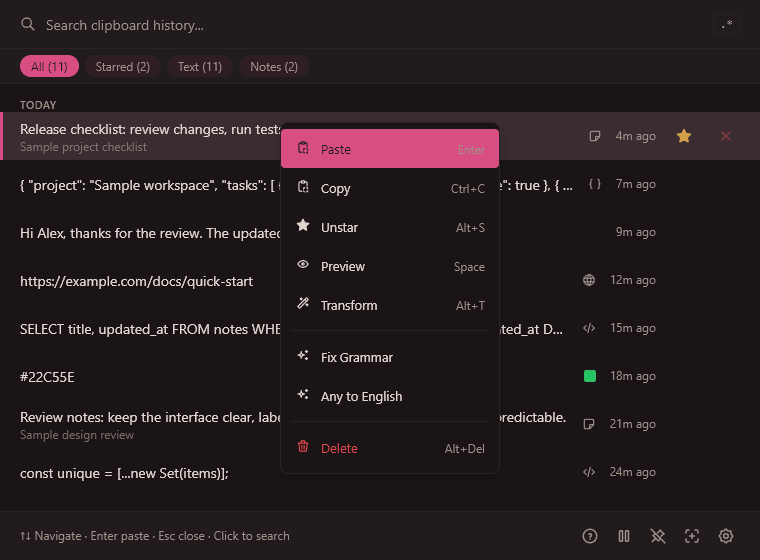

# Beetroot User Guide

Beetroot is a clipboard manager for Windows. While monitoring is enabled it saves supported text and images, subject to exclusions and limits, so you can search, preview, transform and reuse them later.

**Documentation scope:** Current source, including changes planned for 1.6.7. See the [release status](index.md); this is not the documentation bundled with the current 1.6.6 installer.
**Platform:** Windows 10 and Windows 11
**Price:** Free
**Last updated:** 2026-09-08

---

## Table of Contents

- [Getting Started](#getting-started)
- [Interface Overview](#interface-overview)
  - [Main Window](#main-window)
  - [Search Bar](#search-bar)
  - [Filter Bar](#filter-bar)
  - [Clipboard List](#clipboard-list)
  - [Footer Bar](#footer-bar)
  - [Preview Panel](#preview-panel)
  - [Context Menu](#context-menu)
  - [Transform Menu](#transform-menu)
  - [Settings](#settings)
  - [System Tray](#system-tray)
  - [Onboarding (Welcome Guide)](#onboarding-welcome-guide)
  - [Keyboard Shortcuts Panel](#keyboard-shortcuts-panel)
  - [Update Banner](#update-banner)
- [Features](#features)
  - [Clipboard Capture and History](#clipboard-capture-and-history)
  - [Search](#search)
  - [AI Transforms](#ai-transforms)
  - [OCR (Text Extraction from Images)](#ocr-text-extraction-from-images)
  - [Starring and Notes](#starring-and-notes)
  - [Batch Operations](#batch-operations)
  - [Themes and Appearance](#themes-and-appearance)
  - [Backup and Recovery](#backup-and-recovery)
  - [Multi-Monitor Support](#multi-monitor-support)
  - [No-Focus Window](#no-focus-window)
  - [Copied Overlay](#copied-overlay)
  - [Window Position](#window-position)
  - [Pin Window (Always on Top)](#pin-window-always-on-top)
  - [Follow Cursor](#follow-cursor)
  - [Plain Text Paste](#plain-text-paste)
  - [Content Detection](#content-detection)
  - [Source App Tracking](#source-app-tracking)
  - [Auto-Update](#auto-update)
- [Settings Reference](#settings-reference)
  - [General Tab](#general-tab)
  - [Shortcuts Tab](#shortcuts-tab)
  - [Language Tab](#language-tab)
  - [Appearance Tab](#appearance-tab)
  - [AI Tab](#ai-tab)
  - [Data Tab](#data-tab)
  - [About Tab](#about-tab)
- [Keyboard Shortcuts](#keyboard-shortcuts)
- [Troubleshooting](#troubleshooting)
- [FAQ](#faq)

---

## Getting Started

Get productive with Beetroot in under five minutes:

1. **Install Beetroot.** Run the installer (.exe or .msi). It starts automatically after installation.

2. **Beetroot runs in the background.** Look for its icon in the system tray. Pause monitoring before copying sensitive content you do not want in history.

3. **Open Beetroot with `Ctrl+`` (backtick).** This is the key to the left of `1` on most keyboards. The Beetroot window appears on whichever monitor your cursor is on.

4. **Copy something, then open Beetroot.** You'll see your copied text (or image) in the list. Copy a few more things -- they all appear in order.

5. **Paste from history.** Open with the hotkey, select a clip and press Enter. Normal paste mode returns to the original input. Pinned windows, copy-only settings or an unavailable target copy with feedback instead; focus the destination and paste manually.

6. **Search your history.** Click the search field and type a query. Press Enter to use the selected result. Activating search can end a focus-sensitive field such as Explorer's rename box; copy and paste manually if that happens.

7. **Preview a clip.** Press Space to see the full content of any clip -- including syntax-highlighted code, full images, and metadata.

That's it. Beetroot runs silently in the background, capturing your clipboard. Open it whenever you need something you copied earlier.

> **Tip:** If `Ctrl+`` doesn't work on your keyboard layout (e.g., AZERTY or QWERTZ), go to Settings > Shortcuts and record a new hotkey that works for you.

---

## Interface Overview

### Main Window

The main window is what you see when you press the global hotkey. It has these sections from top to bottom:

| Section            | Description                                                                     |
| ------------------ | ------------------------------------------------------------------------------- |
| **Drag handle**    | Only visible when window is pinned. Lets you drag the window around.            |
| **Search bar**     | Type to search your clipboard history.                                          |
| **Filter bar**     | Filter chips (All, Starred, Text, Image, Notes) plus an Apps dropdown.          |
| **Clipboard list** | Scrollable list of your clips, grouped by date.                                 |
| **Footer bar**     | Shortcut hints, plus buttons for Help, Pause, Pin, Follow Cursor, and Settings. |

**How the window behaves:**

- Opens on the monitor where your cursor is without stealing focus from the active app (no-focus mode)
- Hides automatically when you click away (loses focus)
- Press `Escape` to hide it
- When pinned, stays visible and doesn't hide on blur

---

### Search Bar

The search bar is at the top of the window. A no-focus hotkey opening leaves your original app active; click the search field before typing a query.

| Element                 | Description                                                                                    |
| ----------------------- | ---------------------------------------------------------------------------------------------- |
| **Search input**        | Type to search. Results update instantly (with a tiny delay to avoid flickering).              |
| **Regex toggle (`.*`)** | Click to switch between normal search and regex search. Highlighted when regex mode is active. |
| **Result count**        | Shows how many clips match your search (e.g., "12 found"). Only visible when searching.        |
| **Clear button (X)**    | Appears when there's text in the search. Click to clear and show all clips.                    |

> **Tip:** Search looks at clip content, notes, source app names, and window titles. If your normal search doesn't find what you need, try the regex toggle for pattern matching.

---

### Filter Bar

Below the search bar, filter chips let you narrow what's shown.

| Filter      | Shows                                                                                      |
| ----------- | ------------------------------------------------------------------------------------------ |
| **All**     | Every clip in your history.                                                                |
| **Starred** | Only clips you've starred (marked as favorites).                                           |
| **Text**    | Only text clips (no images).                                                               |
| **Image**   | Only image clips. Appears only if you have images in history.                              |
| **Notes**   | Only clips that have a note attached. Appears only if any clip has a note.                 |
| **Apps**    | A dropdown that filters by the application a clip was copied from (e.g., Chrome, VS Code). |

Each filter chip shows a count in parentheses.

**Apps dropdown:** Click the "Apps" button to see a list of all source applications. The dropdown includes:

- A search field to find apps by name
- Sort buttons: by last used, most used, or alphabetical
- An "AI Transform" entry for clips generated by AI

Navigate filters with `Left Arrow` / `Right Arrow` keys. Your selected filter is remembered between sessions.

---

### Clipboard List

The main area shows your clips in a scrollable, virtualized list. Clips are grouped by date:

- **Today**
- **Yesterday**
- **This week**
- **Older**

Each clip row shows:

| Element                   | Description                                                                                                 |
| ------------------------- | ----------------------------------------------------------------------------------------------------------- |
| **App icon**              | Small icon of the application the text was copied from. AI-generated clips show a sparkle icon.             |
| **Content preview**       | First line of text, or a thumbnail for images. Search matches are highlighted in yellow.                    |
| **Content type badge**    | Colored label: URL (blue), Email (purple), Code (green), JSON (orange), or a color swatch for color values. |
| **Note icon**             | Small icon indicating this clip has a note attached.                                                        |
| **Relative time**         | "2m ago", "3h ago", "Yesterday", etc.                                                                       |
| **Star button**           | Click to star/unstar a clip. Starred clips are never auto-deleted.                                          |
| **Delete button**         | Click to remove a clip from history.                                                                        |
| **Multi-select checkbox** | Appears when multi-select mode is active.                                                                   |

**New clip animation:** When a new clip arrives, it flashes briefly at the top of the list.

**Pasting indicator:** When you paste a clip, it briefly shows a "pasting" state.

---

### Footer Bar

The bottom bar of the main window.

**Normal mode:**

| Element              | Description                                                                                                 |
| -------------------- | ----------------------------------------------------------------------------------------------------------- |
| **Hint text**        | Shows key shortcuts: "Enter paste / Space preview / Alt+T transform / Esc close" (adapts based on context). |
| **? button**         | Opens the keyboard shortcuts panel.                                                                         |
| **Pause button**     | Pauses or resumes clipboard monitoring. When paused, a yellow banner appears above the list.                |
| **Pin button**       | Toggles "Pin on top" mode. See [Pin Window](#pin-window-always-on-top).                                     |
| **Crosshair button** | Toggles "Follow cursor" mode. See [Follow Cursor](#follow-cursor).                                          |
| **Gear button**      | Opens Settings.                                                                                             |

**Multi-select mode** (when one or more clips are checked):

| Element            | Description                                                                                          |
| ------------------ | ---------------------------------------------------------------------------------------------------- |
| **Selected count** | "3 selected - Ctrl+Click to toggle"                                                                  |
| **Paste dropdown** | Merges selected text clips and pastes them. Choose a separator: Newline, Comma, Space, Tab, or None. |
| **Delete button**  | Deletes all selected clips.                                                                          |
| **Cancel button**  | Exits multi-select mode.                                                                             |

---

### Preview Panel

A full-screen overlay showing the complete content of a clip. Open it by pressing `Space` on any clip, or via the context menu.

| Element            | Description                                                                                                                                     |
| ------------------ | ----------------------------------------------------------------------------------------------------------------------------------------------- |
| **Header**         | Dynamic header showing the source app, content type, and a stat (character count, dimensions, etc.), with a Copy button and a Close (X) button. |
| **Content area**   | Full text with syntax highlighting for code, or a zoomable image. Click an image to toggle between fit-to-window and 100% zoom.                 |
| **Color swatch**   | If the clip is a color value, shows a visual preview of that color.                                                                             |
| **Language badge** | For code clips, shows the detected programming language (e.g., "javascript", "python").                                                         |
| **Note input**     | Collapsed by default. Click to expand and add or edit a note. Notes are saved automatically when you close the panel or click away.             |
| **Footer hints**   | Keyboard shortcut hints, localized to your interface language.                                                                                  |

**Keyboard shortcuts in Preview:**

- `Arrow Up / Arrow Down` -- Navigate to the previous / next clip without closing preview
- `Space` or `Escape` -- Close
- `Ctrl+C` -- Copy the content to clipboard
- `Enter` in the note field -- Save note and blur

---

### Context Menu

Right-click any clip (or press `Shift+F10` / the `ContextMenu` key) to see the context menu.

| Menu Item                   | When Visible                                   | Keyboard Hint |
| --------------------------- | ---------------------------------------------- | ------------- |
| **Paste**                   | In auto-paste mode (not pinned, not copy-only) | Enter         |
| **Copy**                    | Always                                         | Ctrl+C        |
| **Star / Unstar**           | Always                                         | Alt+S         |
| **Preview**                 | Always                                         | Space         |
| **Transform**               | Text clips only                                | Alt+T         |
| **Show in Explorer**        | Image clips only                               | --            |
| **Extract text (OCR)**      | Image clips only                               | --            |
| **Open in browser**         | When clip contains a URL                       | --            |
| **AI Quick Access prompts** | Text clips, when AI is configured              | --            |
| **Delete**                  | Always                                         | Alt+Del       |

Navigate with `Arrow Up/Down`, activate with `Enter` or click, close with `Escape`.

The AI Quick Access section shows your prompts that have "Quick Access" enabled (up to 5). Each runs immediately from the context menu without opening the Transform panel.

---

### Transform Menu

A panel for transforming text clips. Open it with `Alt+T` or via the context menu.

**Text transforms (instant, no AI needed):**

| Transform             | What it does                                                       |
| --------------------- | ------------------------------------------------------------------ |
| **UPPERCASE**         | Converts all text to uppercase.                                    |
| **lowercase**         | Converts all text to lowercase.                                    |
| **Title Case**        | Capitalizes the first letter of each word.                         |
| **Trim whitespace**   | Removes leading/trailing whitespace and collapses multiple spaces. |
| **Remove Spaces**     | Removes all spaces from the text.                                  |
| **Single Line**       | Joins all lines into one, replacing line breaks with spaces.       |
| **Sort Lines**        | Sorts all lines alphabetically.                                    |
| **Remove Duplicates** | Removes duplicate lines, keeping the first occurrence of each.     |

Each text transform shows a live preview of the first 60 characters.

**Search filter:** When the menu has 6 or more items, a search field appears at the top so you can quickly filter transforms and AI prompts by name.

**AI transforms:** Below the text transforms, if you have AI configured, all your AI prompts appear. Select one to send the clip's text to your AI provider and save the result as a new clip.

If AI is not configured, you'll see "Set API key in Settings" (or "Set Local LLM endpoint in Settings" for local providers).

The active AI model is shown next to the "AI Transforms" header.

---

### Settings

A full-page panel with 7 tabs. Open it from the gear icon in the footer bar. Press `Escape` to close without saving, or click "Save" to apply changes.

The sidebar tabs are:

1. General
2. Shortcuts
3. Language
4. Appearance
5. AI
6. Data
7. About

See the [Settings Reference](#settings-reference) section for detailed documentation of every option.

---

### System Tray

Beetroot places an icon in your Windows system tray (notification area).

**Icon:** Adapts automatically to your Windows theme (light or dark taskbar).

| Action          | Result                            |
| --------------- | --------------------------------- |
| **Left-click**  | Show or hide the Beetroot window. |
| **Right-click** | Opens a menu with three options.  |

**Tray menu:**

| Menu Item          | Description                           |
| ------------------ | ------------------------------------- |
| **Show / Hide**    | Toggle the main window.               |
| **Pause / Resume** | Pause or resume clipboard monitoring. |
| **Quit**           | Exit Beetroot completely.             |

---

### Onboarding (Welcome Guide)

A 5-step wizard that appears on first launch.

| Step | Title                  | Content                                                       |
| ---- | ---------------------- | ------------------------------------------------------------- |
| 1    | Meet Beetroot          | Introduction to what Beetroot does.                           |
| 2    | Press {hotkey} to open | Explains the global hotkey and system tray.                   |
| 3    | Smart Search           | How to search and use regex mode.                             |
| 4    | AI Transforms          | How to transform text with Alt+T.                             |
| 5    | You're all set!        | Summary of click-to-paste, right-click options, and Settings. |

Navigate with arrow keys or click Next/Skip. You can replay this guide anytime from Settings > About > "Show welcome guide".

---

### Keyboard Shortcuts Panel

A quick-reference overlay. Open it by clicking the `?` button in the footer bar. Press `Escape` or `?` again to close.

---

### Update Banner

When an update is available, a banner appears at the top of the main window.

| State           | What you see                                                                    |
| --------------- | ------------------------------------------------------------------------------- |
| **Available**   | "Update available: vX.Y.Z" with a Download button and a "Later" dismiss button. |
| **Downloading** | "Downloading update..." with a progress percentage.                             |
| **Ready**       | "Update ready. Restart to apply." with a "Restart now" button.                  |

You can also check for updates manually in Settings > About.

---

## Features

### Clipboard Capture and History

Beetroot monitors your Windows clipboard in the background. Every time you copy text or an image, Beetroot saves it.

**What gets captured:**

- Text (any length up to ~1 MB)
- Images (up to ~10 MB)
- Rich text / HTML content (stored alongside plain text)

**What doesn't get captured:**

- Content copied from password managers (Beetroot detects and skips these)
- Content copied while monitoring is paused

**Deduplication:** If you copy the same text again, Beetroot doesn't create a duplicate. Instead, it moves the existing clip to the top and updates its timestamp.

**History limits:** By default, Beetroot keeps 500 clips. You can change this to 100, 250, 1000, or Unlimited in Settings > General. When the limit is reached, the oldest non-starred clips are removed.

**Auto-delete:** Optionally, Beetroot can automatically delete non-starred clips older than 1 day, 7 days, or 30 days. Set this in Settings > General. Starred clips are never auto-deleted.

**Ordering:** Clips are sorted by most recently used (copied or pasted). Starred clips are always included regardless of history limit. Use the **Starred** filter to view only starred clips.

> **Tip:** Star important clips (Alt+S) so they're never automatically removed, no matter what your history limit or auto-delete settings are.

---

### Search

Beetroot offers two search modes: **normal search** and **regex search**.

#### Normal Search (default)

Click the search field and type. Search runs in the Rust backend with accent folding (so "cafe" can find "café"), whitespace normalization and ranked matching:

1. **Contiguous substring match** in clip content and notes -- highest priority.
2. **Word-start matching** -- your query matches the beginning of words (useful for finding "JavaScript" by typing "java scr").
3. **Secondary fields** -- searches source app name and window title.
4. **Secondary word-start matching** -- word-start matching applied to secondary fields.
5. **Fuzzy search (Levenshtein)** -- tolerates typos when exact methods find fewer than 5 results.

Results are ranked by match quality, then by recency. Search matches are highlighted in yellow in the list.

#### Regex Search

Click the `.*` button in the search bar to switch to regex mode. Type any regular expression pattern (e.g., `\d{3}-\d{4}` to find phone-number-like patterns).

- Case-insensitive by default
- Invalid patterns show an error message below the search bar
- Searches content, notes, source app, and window title

Toggle back by clicking `.*` again.

> **Tip:** You can search across all fields -- if you remember the app you copied from but not the exact text, try searching for the app name.

---

### AI Transforms

Beetroot stores clipboard history locally. Optional cloud AI sends selected content and a prompt to the provider you choose, using your own API key. Local AI connects to a loopback server that you run. See [PRIVACY.md](../../PRIVACY.md) for network activity and storage details.

#### Supported Providers

| Provider          | Models                                                   | API Key Source        |
| ----------------- | -------------------------------------------------------- | --------------------- |
| **OpenAI**        | gpt-5.4-nano (fast/cheap), gpt-5.4-mini (smarter)        | platform.openai.com   |
| **Google Gemini** | gemini-2.5-flash-lite (fast), gemini-2.5-flash (smarter) | aistudio.google.com   |
| **Anthropic**     | claude-haiku-4-5 (fast), claude-sonnet-4-6 (smarter)     | console.anthropic.com |
| **DeepSeek**      | deepseek-chat (fast), deepseek-reasoner (deep reasoning) | platform.deepseek.com |
| **Local LLM**     | Any model via Ollama, LM Studio, or compatible endpoint  | No key needed         |

#### Setup

1. Open Settings > AI.
2. Select your provider.
3. For cloud providers: paste your key, click **Save key now**, then **Test**. Keys are stored in Windows Credential Manager. The bottom **Save** button saves other provider/model settings separately.
4. For Local LLM: select a preset (LM Studio or Ollama) or enter a custom endpoint. Click "Test" to connect.

#### Built-in Prompts

Beetroot comes with 10 built-in AI prompts:

| Prompt            | What it does                                          |
| ----------------- | ----------------------------------------------------- |
| Fix Grammar       | Corrects grammatical errors without changing meaning. |
| Any to English    | Detects the language and translates to English.       |
| Summarize         | Condenses text into 2-3 key sentences.                |
| Make Professional | Rewrites in a clear, business-appropriate tone.       |
| Format as Code    | Applies proper indentation and formatting.            |
| Bullet Points     | Converts text into a bulleted list.                   |
| Simplify          | Rewrites in plain, simple language.                   |
| Make Shorter      | Condenses to roughly half the length.                 |
| Explain This      | Explains in simple terms for anyone.                  |
| Extract Key Data  | Extracts names, dates, numbers, URLs from text.       |

#### Custom Prompts

You can create up to 20 custom prompts (including the 10 built-ins) in Settings > AI. Each prompt has:

- A name (up to 20 characters)
- An instruction text (up to 500 characters)
- A "Quick Access" checkbox

#### Quick Access

Check "Quick Access" on up to 5 prompts to make them appear directly in the right-click context menu. This lets you apply common transforms with a single right-click, without opening the full Transform panel.

#### Using AI Transforms

**Method 1: Transform panel**

1. Select a text clip.
2. Press `Alt+T` (or right-click > Transform).
3. Choose a text transform (instant) or an AI prompt (sends to your provider).
4. The result is saved as a new clip in your history.

**Method 2: Quick Access from context menu**

1. Right-click a text clip.
2. Click one of your Quick Access AI prompts at the bottom of the menu.
3. The result is saved as a new clip.

> **Tip:** Requests have time and size limits. If a request is too large or times out, shorten the selected content or try another model. Encoded text size matters, not just the character count.

---

### OCR (Text Extraction from Images)

Beetroot can extract text from copied images using Windows built-in OCR (no internet required).

**How to use OCR:**

1. Copy an image (screenshot, photo, etc.).
2. Open Beetroot and find the image clip.
3. Right-click it and select "Extract text (OCR)".
4. Beetroot extracts the text and saves it as a new text clip.

A toast notification tells you when extraction succeeds or if no text was found.

> **Tip:** OCR uses your Windows language settings. It works best with clear, high-contrast text.

---

### Starring and Notes

**Starring** marks a clip as a favorite:

- Starred clips are never auto-deleted, even when history limits are reached.
- Use the **Starred** filter chip to view only your starred clips.
- Toggle with the star icon on each clip, `Alt+S`, or right-click > Star/Unstar.

**Notes** let you annotate any clip:

- Open the Preview panel (press `Space`) and type in the "Note" field at the bottom.
- Notes are saved automatically.
- Clips with notes show a small note icon in the list.
- You can filter to show only clips with notes using the "Notes" filter chip.
- Notes are included in search.

---

### Batch Operations

Select multiple clips and act on them at once.

**How to enter multi-select mode:**

- `Ctrl+Click` on any clip, or
- `Ctrl+Space` to toggle the currently highlighted clip

Checkboxes appear on each clip when multi-select is active. The footer bar switches to show batch actions.

**Available batch actions:**

| Action     | Description                                                                                                                                                            |
| ---------- | ---------------------------------------------------------------------------------------------------------------------------------------------------------------------- |
| **Paste**  | Merges all selected text clips and pastes them. A dropdown lets you choose the separator: Newline, Comma, Space, Tab, or None. Images are skipped with a notification. |
| **Delete** | Deletes all selected clips. Shows an undo toast.                                                                                                                       |
| **Cancel** | Exits multi-select mode.                                                                                                                                               |

---

### Themes and Appearance

Beetroot comes with 9 themes plus a System (auto) option:

| Theme                     | Style                                                                              |
| ------------------------- | ---------------------------------------------------------------------------------- |
| **System**                | Follows your Windows light/dark preference.                                        |
| **Beetroot Dark**         | Warm dark theme with pink accent. The signature look.                              |
| **Beetroot Light**        | Warm light theme with pink accent.                                                 |
| **Tokyo Night Storm**     | Cool dark blue with soft blue accent.                                              |
| **Gruvbox Material Hard** | Retro dark with muted green accent.                                                |
| **GitHub Light Pro**      | Clean white with blue accent.                                                      |
| **Nord Snow**             | Soft light grey with muted blue accent.                                            |
| **Cyberpunk Dark**        | Deep dark with cyan neon accent.                                                   |
| **Cyberpunk Light**       | Light grey with magenta accent.                                                    |
| **Pure Dark**             | True black (#000000) for OLED displays. Forces solid background (no transparency). |

**Custom accent color:** Override the theme's accent color with any color you choose using the color picker in Settings > Appearance.

**Window effects (Windows 11):**

- **Mica** -- Subtle desktop wallpaper tint behind the window. Default on Windows 11.
- **Acrylic** -- Frosted glass blur effect. Works on Windows 10+.
- **Solid** -- No transparency. Best for performance or if effects cause issues.

> **Tip:** Pure Dark theme always uses solid background regardless of your window effect setting -- this ensures true black for OLED screens.

**Font customization:**

- **Font size:** 6 options from Compact (11px) to Largest (18px). Default is 13px.
- **UI font:** 8 options including System Default, Inter, Open Sans, Montserrat, Noto Sans, Verdana, Tahoma, and Arial.
- **Code font:** 5 options for syntax-highlighted content: Consolas (default), Cascadia Mono, JetBrains Mono, Courier New, and Lucida Console.

---

### Backup and Recovery

Beetroot creates database backups. They do not include separate image files, WebView settings or API keys and are not a guarantee against data loss.

**Automatic backups:**

- Beetroot creates timestamped backups of your database periodically (triggered by write activity).
- It keeps up to 3 rolling backups.
- Before any database migration (during updates), a version snapshot is saved.

**Corruption recovery:**

- On startup, Beetroot checks database integrity.
- If corruption is detected, recovery first retains the original database and then looks for a valid backup. Other startup failures stop with an error.
- You'll see a notification: "Database restored from backup. Some recent items may be missing."
- If no valid backup exists, a fresh database is created.

**Manual backup:**

- Quit Beetroot from the tray, then copy your selected data directory, including image files and any database sidecars. Follow the [backup instructions](../../PRIVACY.md#exporting-clipboard-history). There is no complete-profile backup button in the app.

> **Tip:** Keep the original database and backups when investigating a recovery error. Do not repeatedly delete or replace them to force startup.

---

### Multi-Monitor Support

Beetroot is fully multi-monitor aware:

- When you press the global hotkey, the window appears on the monitor where your cursor currently is.
- The window is centered on that monitor, accounting for DPI scaling.
- This works correctly even with mixed-DPI setups (e.g., a 4K laptop screen and a 1080p external monitor).

---

### No-Focus Window

In normal and follow-cursor modes, the global hotkey can show Beetroot without taking focus from your current application. Use navigation keys to select a clip. To type a search query, click the search field first; this activates Beetroot.

Keeping focus in the original application can preserve a temporary input such as an Explorer rename field. Clicking search can close that field; if it is no longer available, Beetroot copies the clip instead of pasting into a different target. Pinned windows also copy instead of automatically pasting.

For recognized terminal applications, Beetroot opens with focus. Automatic paste attempts to return focus to the captured terminal before hiding the popup, then checks the destination again before sending Ctrl+V. If the destination cannot be verified, the content remains copied for manual pasting.

---

### Copied Overlay

When you copy something, Beetroot shows a small frosted-glass "Copied" pill near your cursor for about 1 second. This gives you visual confirmation that the clipboard content was captured, without disrupting your workflow. The overlay is theme-aware, click-through, and works system-wide.

The same overlay confirms copy-only fallback for a selected clip or AI result when the popup has already closed, such as when a modifier key remains held or the destination changes. Focus the destination and press Ctrl+V manually. The popup is not reopened and focus is not taken back for this confirmation.

You can change the overlay's position and duration or toggle it off in Settings > General. With the overlay off, copy-only fallback after the popup closes has no visible confirmation.

---

### Window Position

By default, the Beetroot window opens in the center of the current monitor. You can change this in Settings > General to one of 5 presets:

| Position         | Placement                            |
| ---------------- | ------------------------------------ |
| **Center**       | Centered on the monitor (default).   |
| **Top Left**     | Anchored to the top-left corner.     |
| **Top Right**    | Anchored to the top-right corner.    |
| **Bottom Left**  | Anchored to the bottom-left corner.  |
| **Bottom Right** | Anchored to the bottom-right corner. |

The chosen position applies across all monitors.

---

### Pin Window (Always on Top)

Pin mode keeps the Beetroot window visible on top of all other windows. It stays open even when you click on another application.

**How to activate:**

- Click the pin icon in the footer bar, or
- Press your "Pin window" shortcut (default: `Alt+P` when Beetroot is focused)

**Behavior changes when pinned:**

- The window does NOT hide when it loses focus.
- Clicking a clip **copies** it to your clipboard instead of auto-pasting (because the target app isn't guaranteed to be correct).
- A draggable handle appears at the top of the window so you can reposition it.
- The Enter key copies instead of pasting.

**How to unpin:** Click the pin icon again, or press the shortcut again.

---

### Follow Cursor

Follow Cursor places the popup near your cursor when it opens. It does not continuously follow the mouse while you use the list.

**How to activate:**

- Click the crosshair icon in the footer bar, or
- Press your "Follow cursor" shortcut (default: `Alt+F` when Beetroot is focused)

This is useful when you want Beetroot to always be near where you're working.

**How to deactivate:** Click the crosshair icon again, or press the shortcut again.

---

### Plain Text Paste

Sometimes you copy formatted text (bold, colors, links) but want to paste it as plain text.

**Global plain text hotkey:**

- Set a global hotkey in Settings > Shortcuts > "Plain text paste hotkey".
- When pressed, Beetroot pastes the current clipboard content as plain text, stripping all formatting.
- This hotkey is optional (disabled by default) and works system-wide, even when Beetroot is hidden.

**Paste format setting:**

- In Settings > General, you can choose between "Plain text" (default) and "Original" for the paste format.
- "Plain text" always strips formatting when pasting from Beetroot.
- "Original" preserves rich text / HTML formatting.

---

### Content Detection

Beetroot automatically detects what kind of content you've copied and shows visual indicators:

| Type      | Badge Color  | Detection                                                                                 |
| --------- | ------------ | ----------------------------------------------------------------------------------------- |
| **URL**   | Blue         | Starts with `http://`, `https://`, or `www.`                                              |
| **Email** | Purple       | Contains `@` with a domain                                                                |
| **Code**  | Green        | Contains programming keywords, braces, SQL, shell commands, or language-specific patterns |
| **JSON**  | Orange       | Valid JSON starting with `{` or `[`                                                       |
| **Color** | Color swatch | Hex (`#ff0000`), RGB (`rgb(255,0,0)`), or HSL color values                                |

Content type badges appear on each clip in the list and in the preview panel.

For URL clips, the context menu shows an "Open in browser" option.

For color clips, a small colored square shows the actual color.

---

### Source App Tracking

Beetroot tracks which application you copied from:

- Each clip shows the source app's icon and name in the list.
- You can filter clips by source app using the "Apps" dropdown in the filter bar.
- The Preview panel shows both the source app and the window title.

AI-generated clips show a sparkle icon instead of an app icon.

---

### Auto-Update

Beetroot checks for updates automatically (unless you disable this in Settings).

- When an update is available, a banner appears at the top of the main window.
- Click "Download and install" to update, or "Later" to dismiss.
- After downloading, click "Restart now" to apply the update.
- You can also check manually from Settings > About.

Disabling automatic updates stops startup checks, not manual checks, downloads or optional AI/key-test requests. Microsoft Store installations update through Microsoft Store, not this updater.

---

## Settings Reference

### General Tab

| Setting               | Options                                                | Default    | Description                                                                                                  |
| --------------------- | ------------------------------------------------------ | ---------- | ------------------------------------------------------------------------------------------------------------ |
| **History limit**     | 100, 250, 500, 1000, Unlimited                         | 500        | Maximum number of clips to keep. Oldest non-starred clips are removed when the limit is reached.             |
| **Item click action** | Auto-paste, Copy only                                  | Auto-paste | "Auto-paste" types the clip directly into the active app. "Copy only" just copies to clipboard.              |
| **Paste format**      | Plain text, Original                                   | Plain text | "Plain text" strips formatting. "Original" keeps rich text/HTML.                                             |
| **Auto-delete after** | Never, 1 day, 7 days, 30 days                          | Never      | Automatically removes non-starred clips older than this.                                                     |
| **Window position**   | Center, Top Left, Top Right, Bottom Left, Bottom Right | Center     | Where the Beetroot window appears on the current monitor.                                                    |
| **Copied overlay**    | ON / OFF                                               | ON         | Show a small "Copied" pill near your cursor when clipboard content is captured.                              |
| **Autostart**         | ON / OFF                                               | ON         | Launch Beetroot automatically when you log into Windows.                                                     |
| **Auto-update**       | ON / OFF                                               | ON         | Check for updates automatically. When OFF, no automatic network connections are made (except AI transforms). |

---

### Shortcuts Tab

This tab has two sections:

**Global hotkeys** (work even when Beetroot is minimized):

| Shortcut                    | Default             | Required | Description                                                  |
| --------------------------- | ------------------- | -------- | ------------------------------------------------------------ |
| **Global hotkey**           | `Ctrl+`` (backtick) | Yes      | Show/hide the Beetroot window.                               |
| **Plain text paste hotkey** | None                | No       | Paste current clipboard as plain text, stripping formatting. |

**Local shortcuts** (work only when Beetroot is focused):

| Shortcut              | Default | Required | Description                |
| --------------------- | ------- | -------- | -------------------------- |
| **Pin window on top** | `Alt+P` | No       | Toggle always-on-top mode. |
| **Follow cursor**     | `Alt+F` | No       | Toggle follow-cursor mode. |

**To record a new shortcut:**

1. Click the shortcut button (shows the current key combination).
2. The button changes to "Press a key combination..."
3. Press your desired key combination (e.g., `Ctrl+Shift+V`).
4. The new shortcut is captured.
5. Click "Save" to apply.

Click "Reset" to go back to the default. Click "Clear" to disable an optional shortcut.

> **Tip:** Shortcuts must be unique -- you can't assign the same key combination to two different actions.

---

### Language Tab

Beetroot supports 26 languages. The interface language is auto-detected from your Windows settings on first launch.

| Languages available                                                                                                                                                                                                                              |
| ------------------------------------------------------------------------------------------------------------------------------------------------------------------------------------------------------------------------------------------------ |
| English, Russian, German, Spanish, Chinese, Japanese, French, Portuguese, Korean, Turkish, Italian, Polish, Dutch, Ukrainian, Thai, Hindi, Indonesian, Vietnamese, Czech, Hungarian, Romanian, Swedish, Danish, Finnish, Norwegian Bokmal, Malay |

Select a language and click Save. The entire interface updates immediately.

---

### Appearance Tab

| Setting           | Options                                                                                   | Default        | Description                                                                                                |
| ----------------- | ----------------------------------------------------------------------------------------- | -------------- | ---------------------------------------------------------------------------------------------------------- |
| **Theme**         | System + 9 themes                                                                         | System         | See [Themes and Appearance](#themes-and-appearance) for the full list. Changes preview live before saving. |
| **Accent color**  | Color picker                                                                              | Theme default  | Override the theme's accent color. Click "Reset" to return to the theme default.                           |
| **Font size**     | Compact (11px), Small (12px), Default (13px), Large (14px), Larger (16px), Largest (18px) | Default (13px) | Affects all text in the interface. Changes preview live.                                                   |
| **UI font**       | System Default, Inter, Open Sans, Montserrat, Noto Sans, Verdana, Tahoma, Arial           | System Default | Font for all interface text and plain-text content.                                                        |
| **Code font**     | Consolas, Cascadia Mono, JetBrains Mono, Courier New, Lucida Console                      | Consolas       | Font for code, regex, JSON, and monospace content in previews.                                             |
| **Window effect** | Mica (Win11 only), Acrylic, Solid                                                         | Mica           | Mica is a subtle desktop wallpaper tint. Acrylic is frosted glass blur. Solid is opaque with no effects.   |

> **Tip:** Theme and font size changes preview instantly as you click options, so you can see how they look before saving. If you cancel, the original settings are restored.

---

### AI Tab

| Setting      | Options                                               | Default | Description                             |
| ------------ | ----------------------------------------------------- | ------- | --------------------------------------- |
| **Provider** | OpenAI, Google Gemini, Anthropic, DeepSeek, Local LLM | OpenAI  | Which AI service to use for transforms. |

**Provider-specific settings:**

**OpenAI:**
| Field | Description |
|-------|-------------|
| API Key | Your OpenAI API key (starts with `sk-`). Get one at platform.openai.com. |
| Test button | Validates your key against OpenAI's API. |
| Model | gpt-5.4-nano (fastest, cheapest) or gpt-5.4-mini (smarter, for complex tasks). |

**Google Gemini:**
| Field | Description |
|-------|-------------|
| API Key | Your Gemini API key (starts with `AIza`). Get one at aistudio.google.com. |
| Test button | Validates your key. |
| Model | gemini-2.5-flash-lite (fastest) or gemini-2.5-flash (better reasoning). |

**Anthropic:**
| Field | Description |
|-------|-------------|
| API Key | Your Anthropic API key (starts with `sk-ant-`). Get one at console.anthropic.com. |
| Test button | Validates your key. |
| Model | claude-haiku-4-5 (fastest) or claude-sonnet-4-6 (best balance). |

**DeepSeek:**
| Field | Description |
|-------|-------------|
| API Key | Your DeepSeek API key. Get one at platform.deepseek.com. |
| Test button | Validates your key. |
| Model | deepseek-chat (everyday tasks) or deepseek-reasoner (deep reasoning, chain-of-thought). |

**Local LLM:**
| Field | Description |
|-------|-------------|
| Preset | LM Studio (port 1234), Ollama (port 11434), or Custom endpoint. |
| Endpoint URL | The URL of your local LLM server. Must be localhost/127.0.0.1. |
| Test button | Checks connectivity and auto-detects the loaded model. |
| Model | For Ollama: dropdown of installed models. For others: text input (or auto-detected). |

**Custom prompts section** (shared across all providers):

| Field                 | Description                                                                              |
| --------------------- | ---------------------------------------------------------------------------------------- |
| Quick Access checkbox | Check up to 5 prompts to show them in the right-click context menu.                      |
| Built-in prompts      | 10 pre-configured prompts. You can enable/disable Quick Access but can't edit them.      |
| Custom prompts        | Your own prompts. Each has a Name (max 20 chars) and Prompt instruction (max 500 chars). |
| + Add prompt          | Creates a new custom prompt. Maximum 20 total prompts.                                   |

---

### Data Tab

| Setting           | Description                                                                                                    |
| ----------------- | -------------------------------------------------------------------------------------------------------------- |
| **Data location** | Shows the current folder where your database and images are stored. Default: `%APPDATA%\com.beetroot.desktop\` |
| **Move button**   | Copies your database and images to a new folder you choose.                                                    |
| **Switch button** | Points Beetroot to a different existing folder (without copying). An empty folder means a fresh start.         |

**Data statistics:**

| Stat               | Description                       |
| ------------------ | --------------------------------- |
| Total items        | Number of clips in your history.  |
| Text items         | Number of text clips.             |
| Image items        | Number of image clips.            |
| Starred items      | Number of starred clips.          |
| Database size      | Size of the SQLite database file. |
| Images folder size | Total size of stored image files. |

> **Tip:** Beetroot warns about removable drives and cloud-synced folders. Network drives are rejected for database storage. Prefer a local, unsynced folder.

---

### About Tab

Shows:

- Beetroot version number
- "Check for updates" button with status display
- Links to GitHub, Report Issue, Privacy Policy, Terms of Service
- "Built with Tauri + React" credit
- "Show welcome guide" button to replay the onboarding wizard

---

## Keyboard Shortcuts

### Global Shortcuts (work everywhere)

| Shortcut            | Action                                                       |
| ------------------- | ------------------------------------------------------------ |
| `Ctrl+`` (backtick) | Show/hide Beetroot (customizable)                            |
| Plain text hotkey   | Paste clipboard as plain text (customizable, off by default) |

### Main Window

| Shortcut                         | Action                                                                      |
| -------------------------------- | --------------------------------------------------------------------------- |
| `Arrow Up / Down`                | Navigate the clip list                                                      |
| `Home`                           | Jump to first clip                                                          |
| `End`                            | Jump to last clip                                                           |
| `Page Up / Page Down`            | Jump 10 clips up/down                                                       |
| `Enter`                          | Paste selected clip (or copy, if pinned/copy-only mode)                     |
| `Space`                          | Toggle preview for selected clip (open and close; when search bar is empty) |
| `Escape`                         | Hide the Beetroot window                                                    |
| `Ctrl+1` through `Ctrl+9`        | Quick-paste the 1st through 9th clip                                        |
| `Ctrl+C`                         | Copy selected clip to clipboard (without pasting)                           |
| `Alt+S`                          | Star / unstar selected clip                                                 |
| `Alt+T`                          | Open Transform menu for selected clip                                       |
| `Alt+Delete`                     | Delete selected clip                                                        |
| `Ctrl+Space`                     | Toggle multi-select on current clip                                         |
| `Ctrl+Click`                     | Toggle multi-select on clicked clip                                         |
| `Right-click`                    | Open context menu                                                           |
| `Shift+F10` or `ContextMenu` key | Open context menu for selected clip (keyboard)                              |
| `Alt+P`                          | Pin / unpin window (customizable)                                           |
| `Alt+F`                          | Toggle follow cursor (customizable)                                         |

### Search Bar

| Shortcut                          | Action                            |
| --------------------------------- | --------------------------------- |
| Click search, then type           | Activate search and enter a query |
| `.*` button                       | Toggle regex search mode          |
| `X` button or select all + delete | Clear search                      |

### Preview Panel

| Shortcut            | Action                                      |
| ------------------- | ------------------------------------------- |
| `Arrow Up / Down`   | Navigate to previous / next clip in preview |
| `Space` or `Escape` | Close preview                               |
| `Ctrl+C`            | Copy content to clipboard                   |

### Transform Menu

| Shortcut | Action               |
| -------- | -------------------- |
| `Escape` | Close transform menu |

### Context Menu

| Shortcut           | Action                   |
| ------------------ | ------------------------ |
| `Arrow Up / Down`  | Navigate menu items      |
| `Enter` or `Space` | Activate selected option |
| `Escape`           | Close menu               |

### Settings

| Shortcut          | Action                               |
| ----------------- | ------------------------------------ |
| `Escape`          | Close settings (cancel)              |
| `Arrow Up / Down` | Navigate between tabs in the sidebar |
| `Home / End`      | Jump to first / last tab             |

### Filter Bar

| Shortcut             | Action                      |
| -------------------- | --------------------------- |
| `Arrow Left / Right` | Switch between filter chips |
| `Home / End`         | Jump to first / last filter |

---

## Troubleshooting

### Beetroot won't open / hotkey doesn't work

- Make sure Beetroot is running (check for the icon in the system tray).
- Your hotkey might conflict with another application. Go to Settings > Shortcuts and try a different key combination.
- On non-US keyboard layouts (AZERTY, QWERTZ), the backtick key may be in a different position or not available. Record a new hotkey that works for your layout.

### Clipboard monitoring is paused

- Look for a yellow "Clipboard monitoring paused" banner at the top of the list.
- Click the pause/play button in the footer bar to resume.
- You can also resume from the system tray right-click menu.

### "Database corruption detected"

- On startup, Beetroot attempts recovery after retaining the original database. Other startup failures stop with an error; keep the original and backups for investigation.
- You'll see a notification: "Database restored from backup. Some recent items may be missing."
- If no backup is available, a fresh database will be created.

### Cloud sync warning

If you try to move your data folder to a location synced by OneDrive, Dropbox, or Google Drive, Beetroot will warn you. Cloud sync services can cause database corruption because they modify files while Beetroot is using them. Always store Beetroot's data on a local drive.

### USB or network drive warning

Removable storage can interrupt database access, so Beetroot warns before using it. Network drives are rejected for database storage. Prefer a local, unsynced drive.

### AI transforms not working

- **"Set API key in Settings"**: You haven't configured an API key for your chosen provider. Go to Settings > AI and enter your key.
- **"API key is invalid"**: Double-check your key. Make sure you're using the correct key for the selected provider.
- **"Request timed out (30s)"**: The AI provider took too long to respond. Try again later or switch to a faster model.
- **"Empty response"**: The AI returned no content. Try a different prompt or model.
- **"Text too long for AI transform"**: The encoded text exceeds the AI input limit. Select a shorter section.
- **Local LLM "Failed"**: Make sure your local model server (Ollama, LM Studio) is running and the endpoint URL is correct.

### OCR found no text

- OCR works best with clear, high-contrast text on a solid background.
- Very small, blurry, or stylized text may not be recognized.
- OCR uses your Windows language settings for language detection.

### Window appears on the wrong monitor

Beetroot opens on the monitor where your mouse cursor is. If it appears on the wrong screen, move your cursor to the desired monitor before pressing the hotkey.

### App icons not showing

Some applications (especially UWP/Store apps) may not show their icon. Beetroot uses multiple methods to find icons, but some apps store theirs in non-standard locations. This is cosmetic only and doesn't affect functionality.

### Settings won't save

- If you see an error message, read it carefully -- it usually explains what went wrong (e.g., shortcut conflict).
- Make sure no two shortcuts use the same key combination.
- The plain text hotkey must be different from the main hotkey.

---

## FAQ

**Q: Is Beetroot free?**
A: Yes, completely free.

**Q: Does Beetroot send my clipboard data anywhere?**
A: History is stored locally. Cloud AI sends selected content and a prompt to your chosen provider. Updates and saved-key tests also make requests; local AI uses a loopback server with its own settings. See [PRIVACY.md](../../PRIVACY.md).

**Q: Can I use Beetroot without an internet connection?**
A: Yes. Everything except AI transforms (cloud providers) and auto-updates works offline. OCR and all local features work without internet. If you use a local LLM (Ollama, LM Studio), AI transforms work offline too.

**Q: Does Beetroot capture passwords?**
A: Beetroot detects when content is copied from known password managers and skips those clipboard entries. However, if you manually copy a password from a text file or website, it will be captured like any other text.

**Q: Where is my data stored?**
A: By default, in `%APPDATA%\com.beetroot.desktop\`. Settings > Data shows your actual selected history folder. WebView settings and API keys are stored separately.

**Q: Can I sync my clipboard history across computers?**
A: No, and this is intentional. Cloud sync (OneDrive, Dropbox, etc.) can corrupt the SQLite database. Beetroot is designed to work on a single computer.

**Q: How do I completely remove a clip?**
A: Press `Alt+Delete` or right-click > Delete. The clip is immediately removed. You'll see a brief undo toast -- click "Undo" within a few seconds if you made a mistake.

**Q: What happens when I reach the history limit?**
A: The oldest non-starred clips are automatically removed to make room. Starred clips are never removed by the limit.

**Q: Can I use multiple AI providers?**
A: You can configure keys for all providers, but only one is active at a time. Switch between them in Settings > AI. Your keys are saved for each provider.

**Q: How do I stop Beetroot from running?**
A: Right-click the system tray icon and select "Quit". To prevent it from starting with Windows, go to Settings > General and turn off Autostart.

**Q: Does Beetroot work on Windows 10?**
A: Yes. Windows 10 and Windows 11 are both supported. The Mica window effect is only available on Windows 11; Acrylic and Solid work on both.

**Q: What keyboard layouts are supported?**
A: Beetroot detects your active keyboard layout in real-time and adapts hotkeys accordingly. QWERTY, AZERTY, QWERTZ, and layouts with AltGr dead keys are all supported. If the default `Ctrl+`` doesn't work on your layout, you can record any key combination in Settings > Shortcuts.

**Q: Can I export my clipboard history?**
A: Not directly from the UI. Your data is stored in a standard SQLite database that you can access with any SQLite tool if needed.

**Q: How do I report a bug?**
A: Go to Settings > About and click "Report issue" to open a GitHub issue. Include what you were doing, what you expected, and what happened instead.

---

_Last updated: 2026-09-08_
